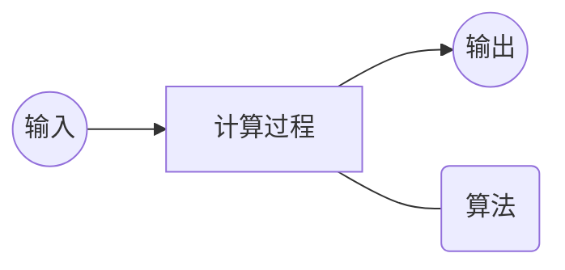
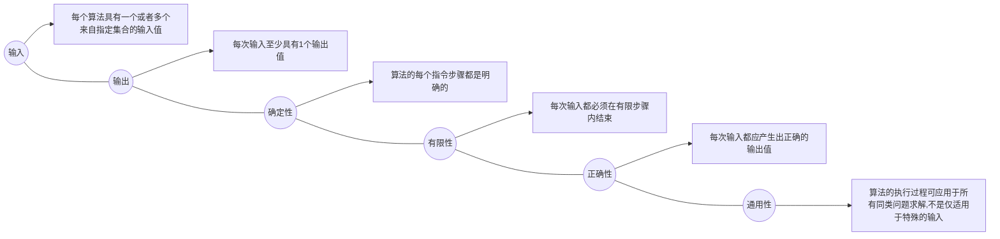

# 课前须知
> [课程主页](http://staff.ustc.edu.cn/~lszhuang)
http://staff.ustc.edu.cn/~lszhuang
## 关于评分
> - 期末考试（闭卷）+平时作业（按时交作业在原有基础+1分）+出勤（未到不扣分，到了加分）
> - 提交作业在bb系统上面的网页系统（搭建的oj系统）
> - 上机有3个实验，建议提前做
> - 本课程不提供补考，只有重修

# 第一章 算法分析技术
## 算法入门
### 课程学习背景
#### 算法定义
- ***算法就是问题的程序化解决方案***。它定义了一个良好的计算过程，取一个或者一组值作为输入，并产生出一个或者一组值作为输出。即：算法就是一系列的计算步骤，用来将输入数据转换成输出结果。



#### 算法特征



#### 问题与问题实例
- 问题:规定了输入于输出之间的关系，可用通用语言来描述。
- 问题实例:某一个问题的实例包含了求解该问题所需的输入。
- 问题例子：
  > ① 排序问题：将一系列数按非降顺序进行排序
  ```
  输入: 由n个数组成的一个序列<𝒂𝟏,𝒂𝟐,…,𝒂𝒏 >
  输出: 对输入系列的一个排列(重排) <𝒂𝟏,𝒂𝟐,…,𝒂𝒏>,使得𝒂𝟏≤𝒂𝟐≤ ⋯ ≤𝒂𝒏
  ```
  > ② 一个实例：
  ```
  Input: <31,41,59,26,41,58> —— Output:      <26,31,41,41,58,59>
  ```

