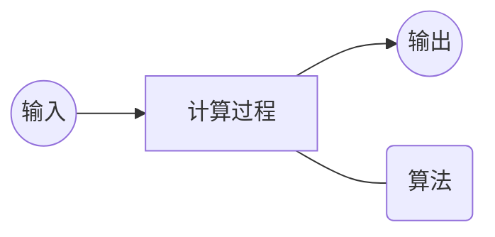
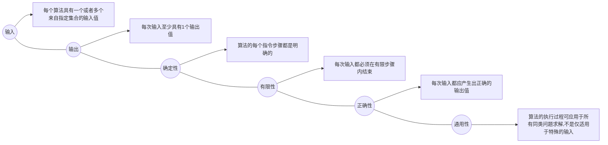

# 课前须知
> [课程主页](http://staff.ustc.edu.cn/~lszhuang)
http://staff.ustc.edu.cn/~lszhuang
## 关于评分
> - 期末考试（闭卷）+平时作业（按时交作业在原有基础+1分）+出勤（未到不扣分，到了加分）
> - 提交作业在bb系统上面的网页系统（搭建的oj系统）
> - 上机有3个实验，建议提前做
> - 本课程不提供补考，只有重修

# 第一章 算法分析技术
## 算法入门
### 课程学习背景（这节不重要）
#### 算法定义
- ***算法就是问题的程序化解决方案***。它定义了一个良好的计算过程，取一个或者一组值作为输入，并产生出一个或者一组值作为输出。即：算法就是一系列的计算步骤，用来将输入数据转换成输出结果。



#### 算法特征



#### 问题与问题实例
- 问题:规定了输入与输出之间的关系，可用通用语言来描述。
- 问题实例:某一个问题的实例包含了求解该问题所需的输入。
- 问题例子：
  > ① 排序问题：将一系列数按非降顺序进行排序
  ```
  输入: 由n个数组成的一个序列<𝒂𝟏,𝒂𝟐,…,𝒂𝒏 >
  输出: 对输入系列的一个排列(重排) <𝒂𝟏,𝒂𝟐,…,𝒂𝒏>,使得𝒂𝟏≤𝒂𝟐≤ ⋯ ≤𝒂𝒏
  ```
  > ② 一个实例：
  ```
  Input: <31,41,59,26,41,58> —— Output:      <26,31,41,41,58,59>
  ```
- 重要问题类型：排序、字符串匹配、图搜索问题、几何问题、数值问题等。

#### 输入实例与问题规模
- 输入实例：问题的具体计算例子；
- 问题规模：算法的输入实例大小。
如, 排序问题的3个输入实例:
```
① 13,5,6,37,8,92,12
② 43,5,23,76,25
③ 53,67,32,42,22,33,4,39,56
上面排序问题的3个输入实例的规模大小分别为7,5,9
```

#### 正确算法与不正确算法
- 正确的算法 
  > 如果一个算法对问题每一个输入实例，都能输出正确的结果并停止，则称它为正确的。
- 不正确的算法
  > - ✓可能根本不会停止；
  > - ✓停止时给出的不是预期的结果；
  > - ✓如果算法的错误率可以控制，
  > - ***也是有用的***。

### 算法分析基础
#### 问题求解与算法描述
##### 问题求解过程
- 与真实代码差异
  > - ① 对特定算法的描述更加的清晰与精确；
  > - ② 不需要考虑太多技术细节（数据抽象、模块、错误处理等）；
  > - ③ 用伪代码可以体现算法本质；
  > - ④ 永远不会过时。
- 伪代码一些约定
  > - ① 书写上的“缩进”表示程序中的分程序（程序块）结构；
  > - ② 循环结构(while, for, repeat) 和条件结构 (if, then, else) 与Pascal, C语言类似；
  > - ③ “// ” or “►”来表示注释；
  > - ④ 利用i←j←e 来表示多重赋值，等价于 j←e 和i←j；
  > - ⑤ 变量是局部于给定过程的；
  > - ⑥ 数组元素的访问方式: A[i] ; A[1 .. j ] = < A[1], A[2],…, A[i]>
  > - ⑦ 符合数据一般组织成对象，由属性（attribute）或域(field)所组成；域的访问是由域名后跟方括号括住的对象名形式来表示, 如length[A]；
  > - ⑧ 参数采用按值传递方式；
  > - ⑨ 布尔操作 “and” 和“or”具有短路能力: 如 “x and (or) y ”: 无论y的值如何，必须首先计算x的值。

#### 算法分析框架
- 算法分析：指对一个算法所需要的资源进行预测，通常是对计算时间和空间的预测。
  - [x] 默认情况下，一般是指对算法时间效率的分析；
  - [x] 目的是从多个候选算法中选择一个最有效的算法或者去掉较差的算法。
- 随机存取机模型
  - [x] 指令时逐条执行的，没有并发操作；
  - [x] 只包含常用指令且指令执行时间为常量；
  - [x] 数据类型有整数类型和浮点实数类型；
  - [x] 不对存储器层次进行建模。


