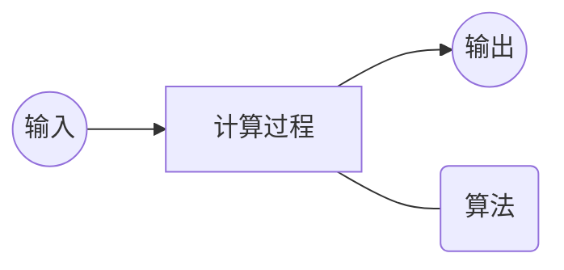
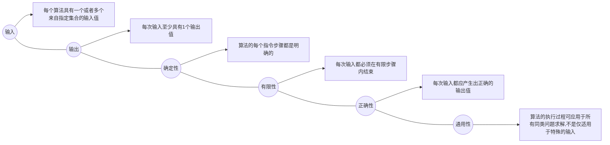
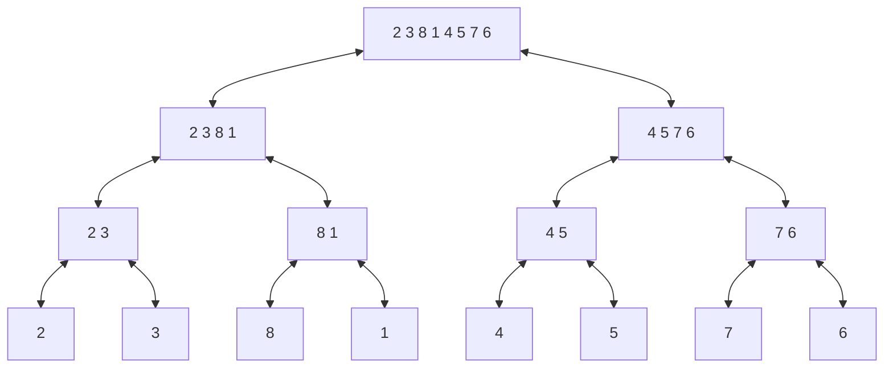
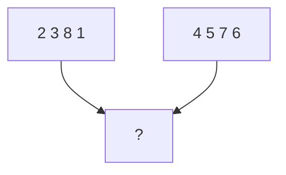
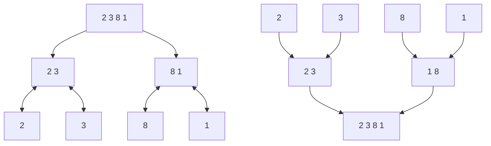

# 课前须知
> [课程主页](http://staff.ustc.edu.cn/~lszhuang)
http://staff.ustc.edu.cn/~lszhuang
## 关于评分
> - 期末考试（闭卷）+平时作业（按时交作业在原有基础+1分）+出勤（未到不扣分，到了加分）
> - 提交作业在bb系统上面的网页系统（搭建的oj系统）
> - 上机有3个实验，建议提前做
> - 本课程不提供补考，只有重修

# 第一章 算法分析技术
## 算法入门
### 课程学习背景（这节不重要）
#### 算法定义
- ***算法就是问题的程序化解决方案***。它定义了一个良好的计算过程，取一个或者一组值作为输入，并产生出一个或者一组值作为输出。即：算法就是一系列的计算步骤，用来将输入数据转换成输出结果。



#### 算法特征



#### 问题与问题实例
- 问题:规定了输入与输出之间的关系，可用通用语言来描述。
- 问题实例:某一个问题的实例包含了求解该问题所需的输入。
- 问题例子：
  > ① 排序问题：将一系列数按非降顺序进行排序
  ```
  输入: 由n个数组成的一个序列<𝒂𝟏,𝒂𝟐,…,𝒂𝒏 >
  输出: 对输入系列的一个排列(重排) <𝒂𝟏,𝒂𝟐,…,𝒂𝒏>,使得𝒂𝟏≤𝒂𝟐≤ ⋯ ≤𝒂𝒏
  ```
  > ② 一个实例：
  ```
  Input: <31,41,59,26,41,58> —— Output:      <26,31,41,41,58,59>
  ```
- 重要问题类型：排序、字符串匹配、图搜索问题、几何问题、数值问题等。

#### 输入实例与问题规模
- 输入实例：问题的具体计算例子；
- 问题规模：算法的输入实例大小。
如, 排序问题的3个输入实例:
```
① 13,5,6,37,8,92,12
② 43,5,23,76,25
③ 53,67,32,42,22,33,4,39,56
上面排序问题的3个输入实例的规模大小分别为7,5,9
```

#### 正确算法与不正确算法
- 正确的算法 
  > 如果一个算法对问题每一个输入实例，都能输出正确的结果并停止，则称它为正确的。
- 不正确的算法
  > - ✓可能根本不会停止；
  > - ✓停止时给出的不是预期的结果；
  > - ✓如果算法的错误率可以控制，
  > - ***也是有用的***。

### 算法分析基础
#### 问题求解与算法描述
##### 问题求解过程
- 与真实代码差异
  > - ① 对特定算法的描述更加的清晰与精确；
  > - ② 不需要考虑太多技术细节（数据抽象、模块、错误处理等）；
  > - ③ 用伪代码可以体现算法本质；
  > - ④ 永远不会过时。
- 伪代码一些约定
  > - ① 书写上的“缩进”表示程序中的分程序（程序块）结构；
  > - ② 循环结构(while, for, repeat) 和条件结构 (if, then, else) 与Pascal, C语言类似；
  > - ③ “// ” or “►”来表示注释；
  > - ④ 利用i←j←e 来表示多重赋值，等价于 j←e 和i←j；
  > - ⑤ 变量是局部于给定过程的；
  > - ⑥ 数组元素的访问方式: A[i] ; A[1 .. j ] = < A[1], A[2],…, A[i]>
  > - ⑦ 符合数据一般组织成对象，由属性（attribute）或域(field)所组成；域的访问是由域名后跟方括号括住的对象名形式来表示, 如length[A]；
  > - ⑧ 参数采用按值传递方式；
  > - ⑨ 布尔操作 “and” 和“or”具有短路能力: 如 “x and (or) y ”: 无论y的值如何，必须首先计算x的值。

#### 算法分析框架(import)
- [ ] 算法分析：指对一个算法所需要的 ***资源*** 进行预测，通常是对计算 ***时间和空间*** 的预测。
  - [x] 默认情况下，一般是指对算法 ***时间效率*** 的分析；
  - [x] ***目的是从多个候选算法中选择一个最有效的算法或者去掉较差的算法。***
- [ ] 随机存取机模型
  - [x] 指令时逐条执行的，没有并发操作；
  - [x] 只包含常用指令且指令执行时间为常量；
  - [x] 数据类型有整数类型和浮点实数类型；
  - [x] 不对存储器层次进行建模。
- ***算法运行时间是指在特定输入时，所执行的基本操作数。***
- ***输入数据的规模和分布*** 是影响算法运行时间的两个 ***主要因素***。
- ***算法时间效率分析框架：***
  - [x] 算法时间效率用算法输入规模n为参数的函数来度量；
  - [x] 对输入规模相同情况下，有些算法的时间效率会有明显差异。对于这样的算法要区分最坏运行时间、最佳运行时间、平均运行时间；
  - [x] 对于大规模输入，通常只关注运行时间效率函数的增长率，即只关注函数的高阶项，而忽略低阶项和高阶项系数。
- ***最坏运行时间***
  - [x] 对于规模为n的任何输入，一般考察算法的最坏运行时间。
  - [x] 最坏情况运行时间是在任何输入情况下的一个上界；
  - [x] 对于某些算法来说，最坏情况出现还是比较频繁的，如信息检索（信息经常不存在）；
  - [x] 大致上看，“平均情况”通常和最坏情况一样差。
- 平均运行时间（期望运行时间）
- ***函数的增长率***
  - [x] 抽象简化。忽略每条语句的真实代价，用常量ci来表示；进一步忽略了抽象的代价；
  - [x] 增长率或增长量级。只考虑公式中的最高项，忽略最高项系数和低阶项。

#### 示例:插入排序
##### 问题描述
```
问题描述: 把一系列数据按非递增的顺序排列
输 入: n 个输入数<𝑎1,𝑎2,…,𝑎𝑛>
输 出: 输入系列的一个排序 <𝑎1,𝑎2,…,𝑎𝑛> , 使得𝑎1≤𝑎2≤⋯≤𝑎𝑛
```
##### 算法效率分析
```C
NSERTION-SORT(A)                                               cost times
1 for( j = 2; j <=length[A]; j++)                               c1   n
2 { key = A[j]                                                  c2   n-1
3     // Insert A[j] into the sorted sequence A[1 .. j-1]       0    n-1
4     i = j-1                                                   c4   n-1
5     while( i > 0 && A[i] > key)                               c5
6     { A[i+1] = A[i]                                           c6
7         i = i-1                                               c7
8     }
9     A[i+1] = key                                              c8   n-1
10 }
```
- 总时间效率
  > 注: $t_j$ 为当第j轮执行for循环时，while语句需要执行的次数(重排前面排过序列的次数)
$$T(n)=c_1 n+c_2 (n-1)+c_4 (n-1)+c_5 \sum\limits_{j=2}^n t_j +c_6 \sum\limits_{j=2}^n (t_j -1)+c_7 \sum\limits_{j=2}^n (t_j -1) +c_8 (n-1)
$$
- 如果数组是排好序的，则会出现最好情况：
$$T(n)=c_1 n+c_2 (n-1)+c_4 (n-1)+c_5 (n-1) +c_8 (n-1)=(c_1 +c_2 +c_4 +c_5 +c_8)n–(c_2 +c_4 +c_5 +c_8))=an+b
$$
- 如果数组是逆序排序的，则会出现最坏情况：
$$T(n)=c_1 n+c_2 (n-1)+c_4 (n-1)+c_5 \left(\frac{n(n+1)}{2}-1\right)+c_6 \left(\frac{n(n-1)}{2}\right)+c_7 \left(\frac{n(n-1)}{2}\right)+c_8 (n-1)=an^3 +bn+3
$$
  > 此时必须将每个元素A[j]与整个已排序的子数组A[1..j-1]中的每一个元素进行比较，对j=2,3,…,n,有 $t_j=j$ ,则有：
$$\sum\limits_{j=2}^n j=\frac{n(n+1)}{2}-1，\sum\limits_{j=2}^n (j-1)=\frac{n(n-1)}{2}
$$

### 算法设计策略——分治法
#### 概述
- 核心思想： 分而治之，各个击破。
- 分治策略：
  > ① 将原问题划分为n个规模较小而结构与原问题相似的子问题；

  > ② 递归地解决这些子问题，然后再合并其结果，得到原问题解。

- 三个步骤
  > ① 分解（Divide)：将原问题分成一系列子问题；

  > ② 解决（Conquer)：递归求解各子问题。若子问题足够小，则直接求解；

  > ③ 合并（Combine)：将子问题的结果合并成原问题的解。

#### 示例：归并排序
##### 归并排序算法(Merge sort algorithm)
> ① 分解：把n个元素分成各含n/2个元素的子序列；

> ② 解决：用归并排序算法对两个子序列递归地排序；

> ③ 合并：合并两个已排序的子序列以得到排序结果。


> 对子序列排序时，其长度为1时递归结束。单个元素被视为是已排好序的。

##### 关键步骤
MERGE(A, p, q, r)是关键步骤。
- [x] A是个数组，p, q, r 数组中元素的下标，且p ≤ q < r.
- [x] 假设子数组 A[p .. q] 和 A[q+1 .. r]是有序的，将它们合并成一个已排好序的子数组代替当前子数组 A[p .. r]。
- [x] 合并过程:

  > 合并其实是同层(在此层下层处已经按照该步骤，将该层数组内元素的顺序排好了)合并至上层(父层)，先比较同层的2个子数组中第一个位置元素大小(分别为a，b)，按照排序规则放入上层第一个位置，假设为a，然后比较a所在子数组内的元素和b的大小，再进行放入第二个位置，以此类推排好上层元素顺序。
- [x] MERGE(A, p, q, r)算法伪代码
```C
MERGE(A, p, q, r)                                       cost  times
1 n1 ← q-p+1                                             c    1
2 n2 ← r-q                                               c    1
3 create arrays L[1 .. n1+1] and R[1 .. n2+1]            c    1
4 for i←1 to n1                                          c    n1+1
5     do L[i]←A[p+i-1]                                   c    n1
6 for j←1 to n2                                          c    n2+1
7     do R[j]←A[q+j]                                     c    n2
8 L[n1+1]←∞          //设置哨兵元素                       c    1
9 R[n2+1]←∞          //设置哨兵元素                       c    1
10 i←1                                                   c    1
11 j←1                                                   c    1
12 for k←p to r                                          c    r-p+2
13    do if L[i]≤R[j]                                    c    r-p+1
14        then A[k]←L[i]                                 c    x
15            i←i+1                                      c    x        
16        else A[k]←R[j]                                 c    r-p+1-x
17            j←j+1                                      c    r-p+1-x
```
  - 时间复杂度：
$$𝜃( 𝑛_1 + 𝑛_2)= 𝜃(𝑛)$$
- [x] 递归算法
```C
MERGE-SORT(A, p, r)
1 if p < r
2     Then 𝑞 ← (𝑝 + 𝑟)/2
3         MERGE-SORT(A, p, q)
4         MERGE-SORT(A, q+1, r)
5 MERGE(A, p, q, r)
```


##### 分支法分析
###### 分治法时间复杂度

$$ 
T(n)=
\begin{cases}
  Θ(1), & \text{if } n \geq c \\
  aT(n/b)+D(n)+C(n), & \text{otherwise } 
\end{cases}
$$

➢ D(n)是把原问题分解为子问题所花的时间；

➢ C(n)是把子问题的解合并为原问题的解所花的时间；

➢ T(n)是一个规模为n的问题的运行时间，a和b可认为将规模n分解为a个规模为n/b的问题。
> 为简化算法分析，通常假设n为2的幂次，使得每次分解产生的子序列长度恰为n/2。这一假设并不影响递归式解的增长量级。

###### 合并排序最坏运行时间
- ① 当n=1时，合并排序一个元素的时间是个常量；
- ② 当n>1时，运行时间分解如下：
  > ➢ 分解：仅仅是计算出子数组的中间位置，需要常量时间，D(n)=Θ(1)；
  > 
  > ➢ 解决：递归地求解两个规模为n/2的子问题，时间为2T(n/2)；
  > 
  > ➢ 合并：MERGE过程的运行时间为C(n)=Θ(n)。

$$
T(n)=
\begin{cases}
  Θ(1), & \text{if } n =1 \\
  2T(n/2)+Θ(n), & \text{if } n >1
\end{cases}
$$
##### 归并排序时间复杂度求解
- 递归式重写

$$
T(n)=
\begin{cases}
  Θ(1), & \text{if } n =1 \\
  2T(n/2)+Θ(n), & \text{if } n >1
\end{cases}
 →
T(n)=
\begin{cases}
  Θ(1), & \text{if } n =1 \\
  2T(n/2)+cn, & \text{if } n >1
\end{cases}
$$
- 递归式求解
$$cn(\lg n+1)=cn\lg n+cn=Θ(n\lg n)$$
其中：
  - [x] 每一层总代价: $2^i c(n/2^i)=cn$
    > 即为一个树状图，每层有 $2^i$ 个，每个的运行时间为 $c(n/2^i)$ 。
  - [x] 树的总层数: $\lg n+1$
    > 推导：假设树的总层数为d，则根据等比数列1,2,4,..., $2^d$ 的求和所得 $2^{d+1}-1$ ,则有不等式 $2^{d}-1 \leq n \leq2^{d}-1$ ,求解不等式后可得 $d\approx\lg n+1$
