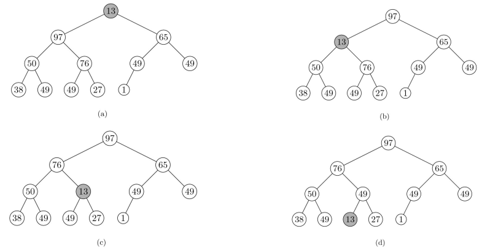

# 课前须知
> [课程主页](http://staff.ustc.edu.cn/~lszhuang)
http://staff.ustc.edu.cn/~lszhuang
## 关于评分
> - 期末考试（闭卷）+平时作业（按时交作业在原有基础+1分，作业也有考研算法部分 ~~，做了加分~~）+出勤（未到不扣分，到了加分）
> - 提交作业在bb系统上面的网页系统（搭建的oj系统(http://202.38.88.88:45008/)）
> - 上机有3个实验，建议提前做
> - 本课程不提供补考，只有重修

# 第一章 算法分析技术
## 1.1 算法入门
### 1.1.1 课程学习背景（这节不重要）
#### 算法定义
- ***算法就是问题的程序化解决方案***。它定义了一个良好的计算过程，取一个或者一组值作为输入，并产生出一个或者一组值作为输出。即：算法就是一系列的计算步骤，用来将输入数据转换成输出结果。


#### 算法特征


#### 问题与问题实例
- 问题:规定了输入与输出之间的关系，可用通用语言来描述。
- 问题实例:某一个问题的实例包含了求解该问题所需的输入。
- 问题例子：
  > ① 排序问题：将一系列数按非降顺序进行排序
  ```
  输入: 由n个数组成的一个序列<𝒂𝟏,𝒂𝟐,…,𝒂𝒏 >
  输出: 对输入系列的一个排列(重排) <𝒂𝟏,𝒂𝟐,…,𝒂𝒏>,使得𝒂𝟏≤𝒂𝟐≤ ⋯ ≤𝒂𝒏
  ```
  > ② 一个实例：
  ```
  Input: <31,41,59,26,41,58> —— Output:      <26,31,41,41,58,59>
  ```
- 重要问题类型：排序、字符串匹配、图搜索问题、几何问题、数值问题等。

#### 输入实例与问题规模
- 输入实例：问题的具体计算例子；
- 问题规模：算法的输入实例大小。
如, 排序问题的3个输入实例:
```
① 13,5,6,37,8,92,12
② 43,5,23,76,25
③ 53,67,32,42,22,33,4,39,56
上面排序问题的3个输入实例的规模大小分别为7,5,9
```

#### 正确算法与不正确算法
- 正确的算法 
  > 如果一个算法对问题每一个输入实例，都能输出正确的结果并停止，则称它为正确的。
- 不正确的算法
  > - ✓可能根本不会停止；
  > - ✓停止时给出的不是预期的结果；
  > - ✓如果算法的错误率可以控制，
  > - ***也是有用的***。

### 1.1.2 算法分析基础
#### 问题求解与算法描述
##### 问题求解过程
- 与真实代码差异
  > - ① 对特定算法的描述更加的清晰与精确；
  > - ② 不需要考虑太多技术细节（数据抽象、模块、错误处理等）；
  > - ③ 用伪代码可以体现算法本质；
  > - ④ 永远不会过时。
- 伪代码一些约定
  > - ① 书写上的“缩进”表示程序中的分程序（程序块）结构；
  > - ② 循环结构(while, for, repeat) 和条件结构 (if, then, else) 与Pascal, C语言类似；
  > - ③ “// ” or “►”来表示注释；
  > - ④ 利用i←j←e 来表示多重赋值，等价于 j←e 和i←j；
  > - ⑤ 变量是局部于给定过程的；
  > - ⑥ 数组元素的访问方式: A[i] ; A[1 .. j ] = < A[1], A[2],…, A[i]>
  > - ⑦ 符合数据一般组织成对象，由属性（attribute）或域(field)所组成；域的访问是由域名后跟方括号括住的对象名形式来表示, 如length[A]；
  > - ⑧ 参数采用按值传递方式；
  > - ⑨ 布尔操作 “and” 和“or”具有短路能力: 如 “x and (or) y ”: 无论y的值如何，必须首先计算x的值。

#### 算法分析框架(import)
- [ ] 算法分析：指对一个算法所需要的 ***资源*** 进行预测，通常是对计算 ***时间和空间*** 的预测。
  - [x] 默认情况下，一般是指对算法 ***时间效率*** 的分析；
  - [x] ***目的是从多个候选算法中选择一个最有效的算法或者去掉较差的算法。***
- [ ] 随机存取机模型
  - [x] 指令时逐条执行的，没有并发操作；
  - [x] 只包含常用指令且指令执行时间为常量；
  - [x] 数据类型有整数类型和浮点实数类型；
  - [x] 不对存储器层次进行建模。
- ***算法运行时间是指在特定输入时，所执行的基本操作数。***
- ***输入数据的规模和分布*** 是影响算法运行时间的两个 ***主要因素***。
- ***算法时间效率分析框架：***
  - [x] 算法时间效率用算法输入规模n为参数的函数来度量；
  - [x] 对输入规模相同情况下，有些算法的时间效率会有明显差异。对于这样的算法要区分最坏运行时间、最佳运行时间、平均运行时间；
  - [x] 对于大规模输入，通常只关注运行时间效率函数的增长率，即只关注函数的高阶项，而忽略低阶项和高阶项系数。
- ***最坏运行时间***
  - [x] 对于规模为n的任何输入，一般考察算法的最坏运行时间。
  - [x] 最坏情况运行时间是在任何输入情况下的一个上界；
  - [x] 对于某些算法来说，最坏情况出现还是比较频繁的，如信息检索（信息经常不存在）；
  - [x] 大致上看，“平均情况”通常和最坏情况一样差。
- 平均运行时间（期望运行时间）
- ***函数的增长率***
  - [x] 抽象简化。忽略每条语句的真实代价，用常量ci来表示；进一步忽略了抽象的代价；
  - [x] 增长率或增长量级。只考虑公式中的最高项，忽略最高项系数和低阶项。

#### 示例:插入排序
##### 问题描述（也叫形式化描述）
> 形式化描述通常包括问题描述、输入、输出和算法，一般简单问题可以只写前三个或者中间两个。

```
问题描述: 把一系列数据按非递增的顺序排列
输 入: n 个输入数<𝑎1,𝑎2,…,𝑎𝑛>
输 出: 输入系列的一个排序 <𝑎1,𝑎2,…,𝑎𝑛> , 使得𝑎1≤𝑎2≤⋯≤𝑎𝑛
```
##### 算法效率分析
```C
NSERTION-SORT(A)                                               cost times
1 for( j = 2; j <=length[A]; j++)                               c1   n
2 {   key = A[j]                                                c2   n-1
3     // Insert A[j] into the sorted sequence A[1 .. j-1]       0    n-1
4     i = j-1                                                   c4   n-1
5     while( i > 0 && A[i] > key)                               c5
6     { A[i+1] = A[i]                                           c6
7         i = i-1                                               c7
8     }
9     A[i+1] = key                                              c8   n-1
10 }
```
- 总时间效率
  > 注: $t_j$ 为当第j轮执行for循环时，while语句需要执行的次数(重排前面排过序列的次数)
$$T(n)=c_1 n+c_2 (n-1)+c_4 (n-1)+c_5 \sum\limits_{j=2}^n t_j +c_6 \sum\limits_{j=2}^n (t_j -1)+c_7 \sum\limits_{j=2}^n (t_j -1) +c_8 (n-1)
$$
- 如果数组是排好序的，则会出现最好情况：
$$T(n)=c_1 n+c_2 (n-1)+c_4 (n-1)+c_5 (n-1) +c_8 (n-1)=(c_1 +c_2 +c_4 +c_5 +c_8)n–(c_2 +c_4 +c_5 +c_8))=an+b
$$
- 如果数组是逆序排序的，则会出现最坏情况：
$$T(n)=c_1 n+c_2 (n-1)+c_4 (n-1)+c_5 \left(\frac{n(n+1)}{2}-1\right)+c_6 \left(\frac{n(n-1)}{2}\right)+c_7 \left(\frac{n(n-1)}{2}\right)+c_8 (n-1)=an^3 +bn+3
$$
  > 此时必须将每个元素A[j]与整个已排序的子数组A[1..j-1]中的每一个元素进行比较，对j=2,3,…,n,有 $t_j=j$ ,则有：
$$\sum\limits_{j=2}^n j=\frac{n(n+1)}{2}-1，\sum\limits_{j=2}^n (j-1)=\frac{n(n-1)}{2}
$$

### 1.1.3 算法设计策略——分治法
#### 概述
- 核心思想： 分而治之，各个击破。
- 分治策略：
  > ① 将原问题划分为n个规模较小而结构与原问题相似的子问题；

  > ② 递归地解决这些子问题，然后再合并其结果，得到原问题解。

- 三个步骤
  > ① 分解（Divide)：将原问题分成一系列子问题；

  > ② 解决（Conquer)：递归求解各子问题。若子问题足够小，则直接求解；

  > ③ 合并（Combine)：将子问题的结果合并成原问题的解。

#### 示例：归并排序
##### 归并排序算法(Merge sort algorithm)
> ① 分解：把n个元素分成各含n/2个元素的子序列；

> ② 解决：用归并排序算法对两个子序列递归地排序；

> ③ 合并：合并两个已排序的子序列以得到排序结果。


> 对子序列排序时，其长度为1时递归结束。单个元素被视为是已排好序的。

##### 关键步骤
MERGE(A, p, q, r)是关键步骤。
- [x] A是个数组，p, q, r 数组中元素的下标，且p ≤ q < r.
- [x] 假设子数组 A[p .. q] 和 A[q+1 .. r]是有序的，将它们合并成一个已排好序的子数组代替当前子数组 A[p .. r]。
- [x] 合并过程:

  > 合并其实是同层(在此层下层处已经按照该步骤，将该层数组内元素的顺序排好了)合并至上层(父层)，先比较同层的2个子数组中第一个位置元素大小(分别为a，b)，按照排序规则放入上层第一个位置，假设为a，然后比较a所在子数组内的元素和b的大小，再进行放入第二个位置，以此类推排好上层元素顺序。
- [x] MERGE(A, p, q, r)算法伪代码
```C
MERGE(A, p, q, r)                                       cost  times
1 n1 ← q-p+1                                             c    1
2 n2 ← r-q                                               c    1
3 create arrays L[1 .. n1+1] and R[1 .. n2+1]               c    1
4 for i←1 to n1                                          c    n1+1
5     do L[i]←A[p+i-1]                                    c    n1
6 for j←1 to n2                                          c    n2+1
7     do R[j]←A[q+j]                                     c    n2
8 L[n1+1]←∞          //设置哨兵元素                         c    1
9 R[n2+1]←∞          //设置哨兵元素                         c    1
10 i←1                                                  c    1
11 j←1                                                  c    1
12 for k←p to r                                          c    r-p+2
13    do if L[i]≤R[j]                                    c    r-p+1
14        then A[k]←L[i]                                 c    x
15            i←i+1                                      c    x        
16        else A[k]←R[j]                                c    r-p+1-x
17            j←j+1                                     c    r-p+1-x
```
  - 时间复杂度：
$$𝜃(𝑛_1 + 𝑛_2)= 𝜃(𝑛)$$
- [x] 递归算法
```C
MERGE-SORT(A, p, r)
1 if p < r
2     Then 𝑞 ← (𝑝 + 𝑟)/2
3         MERGE-SORT(A, p, q)
4         MERGE-SORT(A, q+1, r)
5 MERGE(A, p, q, r)
```


##### 分支法分析
###### 分治法时间复杂度

$$ 
T(n)=
\begin{cases}
  Θ(1), & \text{if } n \geq c \newline
  aT(n/b)+D(n)+C(n), & \text{otherwise } 
\end{cases}
$$

➢ D(n)是把原问题分解为子问题所花的时间；

➢ C(n)是把子问题的解合并为原问题的解所花的时间；

➢ T(n)是一个规模为n的问题的运行时间，a和b可认为将规模n分解为a个规模为n/b的问题。
> 为简化算法分析，通常假设n为2的幂次，使得每次分解产生的子序列长度恰为n/2。这一假设并不影响递归式解的增长量级。

###### 合并排序最坏运行时间
- ① 当n=1时，合并排序一个元素的时间是个常量；
- ② 当n>1时，运行时间分解如下：
  > ➢ 分解：仅仅是计算出子数组的中间位置，需要常量时间，D(n)=Θ(1)；
  > 
  > ➢ 解决：递归地求解两个规模为n/2的子问题，时间为2T(n/2)；
  > 
  > ➢ 合并：MERGE过程的运行时间为C(n)=Θ(n)。

$$
T(n)=
\begin{cases}
  Θ(1), & \text{if } n =1 \newline
  2T(n/2)+Θ(n), & \text{if } n >1
\end{cases}
$$
##### 归并排序时间复杂度求解
- 递归式重写

$$
T(n)=
\begin{cases}
  Θ(1), & \text{if } n =1 \newline
  2T(n/2)+Θ(n), & \text{if } n >1
\end{cases}
 →T(n)=
\begin{cases}
  Θ(1), & \text{if } n =1 \newline
  2T(n/2)+cn, & \text{if } n >1
\end{cases}
$$
- 递归式求解
$$cn(\lg n+1)=cn\lg n+cn=Θ(n\lg n)$$
其中：
  - [x] 每一层总代价: $2^i c(n/2^i)=cn$
    > 即为一个树状图，每层有 $2^i$ 个，每个的运行时间为 $c(n/2^i)$ 。
  - [x] 树的总层数: $\lg n+1$
    > 推导：假设树的总层数为d，则根据等比数列1,2,4,..., $2^d$ 的求和所得 $2^{d+1}-1$ ,则有不等式 $2^{d}-1 \leq n \leq2^{d}-1$ ,求解不等式后可得 $d\approx\lg n+1$

## 1.2 函数增长
### 1.2.1 渐进记号
#### 渐进记号
- 函数的增长量级
  > 用于简单地刻画算法效率，舍弃了低阶项和高阶项的系数。
- 函数的渐近效率
  > 当输入规模无限增加时，描述了算法的运行时间如何随着输入规模的变大而增加。也就是，描述函数的渐近增长行为。
- 渐近记号
  > 用来描述算法渐近运行时间的渐近界，主要用于简化算法的渐近分析。本质上，渐近记号作用于定义域为自然数集N={0,1,2,…}的函数上，代表了一个函数集合。
$$o\approx <;O\approx \leq; \Theta\approx =;\Omega\approx \geq;\omega\approx >$$

#### Θ记号：渐近紧界（asymptotically tight bound）
##### 定义
- 𝜽(𝒈(𝒏))定义：
  > 对给定函数 $𝑔(𝑛)，𝜃(𝑔(𝑛))$ 表示以下函数的集合：
  $$𝜃(𝑔(𝑛))= \lbrace 𝑓(𝑛):∃正常数𝑐_1,𝑐_2,𝑛_0,∀𝑛 ≥ 𝑛_0,有0 ≤ 𝑐_1𝑔(𝑛)≤𝑓(𝑛)≤𝑐_2𝑔(𝑛)\rbrace$$
  > 类似 `夹逼定理` 。
- 说明：
  > ① 𝑔(𝑛)是𝑓(𝑛)的一个渐近紧确界；
  > 
  > ② 𝜃(𝑔(𝑛))定义要求每个成员𝑓(𝑛)均渐近非负，𝑔(𝑛)本身也渐近非负。本课程后面应用于渐近记号的函数均认为满足该假设；
  > 
  > ③ 𝑓(𝑛)∈ 𝜃(𝑔(𝑛))表示𝑓(𝑛)是𝜃(𝑔(𝑛))的成员，可以简写为𝑓(𝑛)= 𝜃(𝑔(𝑛)) 。

##### 举例

例子1：证明 $\frac{n^2}{2}-3n=\omega(n^2)$

证明：假设 $∃c_1,c_2和n_0$ ,使得 $∀𝑛 ≥ 𝑛_0$ ,有 $c_1 n^2 \leq\frac{n^2}{2}-3n \leq c_2n^2$

⟹ $c_1 \leq\frac{1}{2}-\frac{3}{n}\leq c_2$ 当𝑛 → ∞时，可以得到 $c_1 \leq\frac{1}{2},c_2\geq\frac{1}{2}$ 。

取 $c_1=\frac{1}{14},c_2=\frac{1}{2}$ ,以及 $n_0=7$ ,可以证明 $\frac{n^2}{2}-3n=\omega(n^2)$

例子2：证明 $6n^3\neq\omega(n^2)$
证明：(反证法)
假设 $∃c_2 >0,n_0 >0$ 使得所有的 $n>n_0$ ,由 $6n^3\leq\omega(n^2)$ 。

也就是说,对于所有 $n\geq n_0$ 都有 $n\leq c_2/6$ 成立,而不等式的右边是个常数，显然不可能对任意大的𝑛成立。

##### 关于渐进紧界
- 通常情况下，可以把一个函数的低阶项和高阶项系数忽略，从而得到函数的渐近紧界。
  > 比如: $f(n)=an^2+bn+c$ ,其中，a>0,b,c为常量，则有 $f(n)=\theta (n^2)$ 。
- 一般情况下，对任意的多项式 **$p(n)=\sum\limits_{i=0}^d a_in^i$** ,其中 $a_i$ 是常数且 $a_d>0$ , 我们有 $𝒑(𝒏)=\theta (𝒏_d)$ 。
- 任意常数函数都可以用渐近符号 $\theta (𝒏_𝟎)$ 或 $\theta (𝟏)$ 来表示，通常利用 $\theta (𝟏)$ 来表示常数或者常数函数。

#### 𝑂记号：渐近上界（asymptotically upper bound）
##### 𝑂(𝒈(𝒏))定义
- 对给定函数𝑔(𝑛)，𝑂(𝒈(𝒏))表示以下函数的集合：
  $$𝑂(𝑔(𝑛)) = \lbrace 𝑓(𝑛) :∃正常数𝑐,  𝑛_0 > 0，∀𝑛 ≥ 𝑛_0,有0 ≤ 𝑓(𝑛) ≤ 𝑐𝑔(𝑛)\rbrace$$
> 理解为𝑓(n)一直向上趋近于𝑔(𝑛)
##### 关于渐进上界的说明
###### 𝑓(𝑛)=𝑂(𝑔(𝑛))说明
1. 𝑔(𝑛)是𝑓(𝑛)的一个 `渐近上界` ；
2. 每个成员𝑓(𝑛)均渐近非负，𝑔(𝑛)本身也渐近非负；
3. 𝑓(𝑛)= 𝑂(𝑔(𝑛)) 等价于𝑓(𝑛)∈ 𝑂(𝑔(𝑛))，意味着𝑓(𝑛)是集合𝑂(𝑔(𝑛))的成员;
4. 如果𝑓(𝑛)=𝜃(𝑔(𝑛)) ，则𝑓(𝑛)=𝑂(𝑔(𝑛))，𝜃(𝑔(𝑛))=𝑂(𝑔(𝑛))，反之不成立。
###### $𝑂(n^2)$ 函数举例
$an^2+bn+c$ , $an$ , $n^{1.9999}$ , $n^2 / \lg \lg \lg n$

#### 𝜴记号：渐近下界(asymptotically lower bound)
##### 𝜴(𝒈(𝒏))定义
- 对给定函数𝑔(𝑛)，𝛺(𝑔(𝑛))表示以下函数的集合：
  $$𝛺(𝑔(𝑛))=\lbrace 𝑓(𝑛):∃正常数𝑐, 𝑛_0 > 0，∀𝑛 ≥ 𝑛_0,有0 ≤ 𝑐𝑔(𝑛)≤𝑓(𝑛)\rbrace$$
> 理解为𝑓(n)一直向下趋近于𝑔(𝑛)
##### 关于渐进下界的说明
###### 𝑓(𝑛)=𝛺(𝑔(𝑛))说明
1. 𝑔(𝑛)是𝑓(𝑛)的一个 `渐近下界` ；
2. 每个成员𝑓(𝑛)均渐近非负，𝑔(𝑛)本身也渐近非负；
3. 𝑓(𝑛)= 𝛺(𝑔(𝑛)) 等价于𝑓(𝑛)∈ 𝛺(𝑔(𝑛))，意味着𝑓(𝑛)是集合𝛺(𝑔(𝑛))的成员;
4. 如果𝑓(𝑛)=𝜃(𝑔(𝑛)) ，则𝑓(𝑛)=𝛺(𝑔(𝑛))，𝜃(𝑔(𝑛))=𝛺(𝑔(𝑛))，反之不成立。
###### $𝛺(n^2)$ 函数举例
$an^2+bn+c$ , $n^3$ , $n^{2.000001}$ , $n^2 \lg \lg \lg n$
##### 定理1.3.1 
- 对任意两个函数𝒇(𝒏)和𝒈(𝒏)，有𝒇(𝒏)=𝜽(𝒈(𝒏))当且仅当𝒇(𝒏)=𝑶(𝒈(𝒏))且𝒇(𝒏)=𝜴(𝒈(𝒏))同时成立。
  > 证明:
  > 
  > → $𝒇(𝒏)=𝜽(𝒈(𝒏)),then \ ∃c_2>0,c_2>0,n_0>0,$
  > 
  >   $s.t. \ n \geq n_0,0 \leq c_1𝒈(𝒏) \leq 𝒇(𝒏) \leq c_2𝒈(𝒏)$
  > 
  >   $then \ n \geq n_0,0 \leq 𝒇(𝒏) \leq c_2𝒈(𝒏)⟹ 𝒇(𝒏)=𝑶(𝒈(𝒏))$
  >
  >   $then \ n \geq n_0,0 \leq c_1𝒈(𝒏) \leq 𝒇(𝒏)⟹ 𝒇(𝒏)=𝜴(𝒈(𝒏))$
  > 
  > ← $𝒇(𝒏)=𝑶(𝒈(𝒏)),then \ ∃c_2>0,c_{20}>0,n_{20}>0,$
  >
  >   $s.t. n \geq n_{20},0 \leq 𝒇(𝒏) \leq c_{20}𝒈(𝒏)$
  > 
  >   $𝒇(𝒏)=𝜴(𝒈(𝒏)),then \ ∃c_2>0,c_{10}>0,n_{10}>0,$
  > 
  >   $s.t. n \geq n_{10},0 \leq c_{20}𝒈(𝒏) \leq 𝒇(𝒏)$
  >
  >   $let \ n_0=max\lbrace n_{10},n_{20}\rbrace,then \ n \geq n_0$
  > 
  >   $0\leq c_{10}𝒈(𝒏) \leq 𝒇(𝒏)\leq c_{20}𝒈(𝒏),that \ is \ 𝒇(𝒏)=𝜽(𝒈(𝒏))$

#### 关于渐进上界和下界某些说明
- [x] 算法的运行时间为𝑂(𝑔(𝑛))意味着：当𝑛足够大时，对输入规模为𝑛的任意输入，其运算时间至多是𝑔(𝑛)的一个常数倍；
- [x] 算法的运行时间为𝜴(𝑔(𝑛))意味着：当𝑛足够大时，对输入规模为𝑛的任意输入，其运算时间至少是𝑔(𝑛)的一个常数倍；
- [x] 部分问题：
  > ✓ 插入排序的算法运行时间为 $𝑂(𝑛^2)$ ？还是 $𝜴(𝑛^2)$ ？还是 $𝜃(𝑛^2)$ ？
  > > 这个问题的答案应该是要分开回答的，一般最坏情况运行时间为 $𝑂(𝑛^2)$ ，平均运行时间认为是 $𝜃(𝑛^2)$ ，最好情况运行时间为 $𝜴(𝑛^2)$ ,但是一般说插入排序算法运行时间为 $𝜃(𝑛^2)$ ，即说平均时间，这样是准确的且有意义的。
  >
  >  ✓ 插入排序的算法最坏运行时间为 $𝑂(𝑛^2)$ ？还是 $𝜴(𝑛^2)$ ？还是 $𝜃(𝑛^2)$ ？
  > > $𝑂(𝑛^2)$ ,表示在最坏情况下，它的运行时间是二次多项式级别的。
  >
  >  ✓ 如果说一个算法的运行时间不超过 $𝜴(𝑛^2)$ ，这是否有矛盾？为什么？
  > > 说一个算法的运行时间不超过 $𝜴(𝑛^2)$ 没有矛盾，因为这也是一个上界条件，但是这个说法是无意义的，因为 $𝜴(𝑛^2)$ 一般为渐进下界，所以说最差运行时间为 $𝜴(𝑛^2)$ ，会有很大范围浮动，是一个不精确的表述，所以是无意义的。

#### 等式和不等式中的渐近记号
- 如何解释：“𝒏 = $𝑶(𝒏^2)$ ”,” $𝟐𝒏^𝟐 + 𝟑𝒏 + 𝟏 = 𝟐𝒏^2+ 𝜽(𝒏)$ ”, …
  - [ ] 渐近记号单独在等式的右侧，比如𝑛 = $𝑂(𝑛^2)$ ，这表示左侧函数属于右侧集合的一个
成员，即 $𝑛 ∈ 𝑂(𝑛^2)$;
  - [ ] 渐近记号出现在一个公式的内部，比如” $2𝑛^2 + 3𝑛 + 1 = 2𝑛^2 + 𝜃(𝑛)$ ”表示存在某个匿名函数𝑓(𝑛)使得” $2𝑛^2 + 3𝑛 + 1 = 2𝑛^2 + 𝑓(𝑛)$ ”成立，其中𝑓(𝑛)∈ 𝜃(𝑛)；
  - [ ] 渐近记号出现在等式的左侧，可以被解释为无论怎样从左侧渐近记号表示的集合中选择成员，总是可以从右侧的渐近记号表示的集合中选择某个成员使得等式成立。例如“ $2𝑛^2 + 𝜃(𝑛)= 𝜃(𝑛^2)$” 可解释为任给𝑓(𝑛)∈ 𝜃(𝑛)，存在𝑔(𝑛)∈ $𝜃(𝑛^2)$ ，使等式成立。
- [x] **因此，可以列出等式” $𝟐𝒏^𝟐 + 𝟑𝒏 + 𝟏 = 𝟐𝒏^𝟐 + 𝜽 𝒏 = 𝜽(𝒏^𝟐)$ ”.**

#### o记号：非渐近紧确上界
- [x] 𝑂(𝑔(𝑛))的局限性：
  > 如：2𝑛 = 𝑂(𝑛)是渐近紧确的，但是 $2𝑛 = 𝑂(𝑛^2)$ 不是渐近紧确的。
- [x] 𝒐(𝒈(𝒏))表示一个非渐近紧确上界：
  > 对给定函数𝑔(𝑛)，𝑜(𝑔(𝑛))表示以下函数的集合：
  >
  > $𝑜(𝑔(𝑛))=\lbrace 𝑓(𝑛):对于任意正常数𝑐, ∃𝑛_0> 0，∀𝑛 ≥ 𝑛_0,有0 ≤ 𝑓(𝑛) < 𝑐𝑔(𝑛) \rbrace$
  > > 例， $2𝑛 = 𝑜(𝑛^2)$ ，但是 $2𝑛^2 ≠ 𝑜(𝑛^2)$ 。

#### ω记号：非渐近紧确下界
- [x] Ω(𝑔(𝑛))的局限性：
  > 如： $2𝑛^2 = 𝛺(𝑛^2)$ 是渐近紧确的，但是 $2𝑛^2 = 𝛺(𝑛)$ 不是渐近紧确的。
- [x] 𝝎(𝒈(𝒏))表示一个非渐近紧确下界：
  > 对给定函数𝑔(𝑛)，𝜔(𝑔(𝑛))表示以下函数的集合：
  > 
  > $𝜔(𝑔(𝑛))=\lbrace𝑓(𝑛):对于任意正常数𝑐, ∃𝑛_0> 0，∀𝑛 ≥ 𝑛_0,有0 ≤ 𝑐𝑔(𝑛) < 𝑓(𝑛)\rbrace$
  > >例， $2𝑛^2 = ω(𝑛)$ ，但是 $2𝑛^2 ≠ ω(𝑛^2)$ 。
- [x] 𝒇(𝒏)= 𝝎(𝒈(𝒏)) 当且仅当𝑔(𝑛)=𝑜(𝑓(𝑛))成立，存在极限： $\lim\limits_{n \to \infty} \frac{𝑓(𝑛)}{𝑔(𝑛)} = \infty$

#### 函数比较
- [x] 传递性
  > $𝒇(𝒏)=\theta (𝑔(𝑛)) \ and \ 𝑔(𝑛)=\theta (h(𝑛)) \ imply \ 𝒇(𝒏)=\theta (h(𝑛))$
  >
  > $𝒇(𝒏)=O(𝑔(𝑛)) \ and \ 𝑔(𝑛)=O(h(𝑛)) \ imply \ 𝒇(𝒏)=O(h(𝑛))$
  >
  > $𝒇(𝒏)=\Omega(𝑔(𝑛)) \ and \ 𝑔(𝑛)=\Omega (h(𝑛)) \ imply \ 𝒇(𝒏)=\Omega (h(𝑛))$
  >
  > $𝒇(𝒏)=o(𝑔(𝑛)) \ and \ 𝑔(𝑛)=o(h(𝑛)) \ imply \ 𝒇(𝒏)=o(h(𝑛))$
  >
  > $𝒇(𝒏)=w(𝑔(𝑛)) \ and \ 𝑔(𝑛)=w(h(𝑛)) \ imply \ 𝒇(𝒏)=w(h(𝑛))$

- [x] 对称性
  > $𝒇(𝒏)=\theta (𝑔(𝑛)) \ if \ and \ only \ if \ 𝑔(𝑛)=\theta (𝒇(𝒏))$

- [x] 反对称性
  > $𝒇(𝒏)=O(𝑔(𝑛)) \ if \ and \ only \ if \ 𝑔(𝑛)=\Omega (𝑔(𝒏))$
  >
  > $𝒇(𝒏)=\Omega (𝑔(𝑛)) \ if \ and \ only \ if \ 𝑔(𝑛)=O(𝑔(𝒏))$

- [x] 自反性
  > $𝒇(𝒏)=\theta (𝒇(𝒏))$
  >
  > $𝒇(𝒏)=O(𝒇(𝒏))$
  >
  > $𝒇(𝒏)=\Omega(𝒇(𝒏))$

- [x] 与实数比较进行类比
  > $𝒇(𝒏)=o(𝑔(𝑛)) \approx a < b$
  >
  > $𝒇(𝒏)==O(𝑔(𝑛)) \approx a \leq b$
  > 
  > $𝒇(𝒏)=\theta (𝑔(𝑛)) \approx a=b$
  > 
  > $𝒇(𝒏)=\Omega(𝑔(𝑛)) \approx a \geq b$
  > 
  > $𝒇(𝒏)=w(𝑔(𝑛)) \approx a > b$

- [x] 实数的三分性定理
  > 任意两个实数 𝑎 和 𝑏, 它们的大小关系必然满足三种关系的其中之一: 𝑎 < 𝑏, 𝑎 = 𝑏 或𝑎 > 𝑏。
- [x] 不是所有的函数都是渐近可比较的，比如：
  > 函数 $𝑓(𝑛)= 𝑛^{1+𝑠𝑖𝑛𝑛}$ 和 函数 $𝑔(𝑛)=𝑛$ 就无法用渐近记号相互比较！
  > > $-1 \leq sinn \leq 1⟹n^0 \leq n^{1+𝑠𝑖𝑛𝑛} \leq n^2$
  > >
  > > $n^{1+𝑠𝑖𝑛𝑛} \leq n \leq n^{1+𝑠𝑖𝑛𝑛} ,矛盾$

### 1.2.2 常用函数
#### 标准记号与常用函数
- [x] 下取整与上取整(Floors and ceilings)
$$x-1 < \lfloor x \rfloor \leq x \leq \lceil x \rceil < x+1$$
- [x] 模运算(Modular arithmetic)
$$a \ mod \ n=a- \lfloor a/n \rfloor n$$
- [x] 多项式(Polynomials)
$$p(n)=\sum\limits_{i=0}^d a_in^i$$
- [x] 指数(Exponentials)
- [x] 对数(Logarithms)
- [x] 阶乘(Factorials)
> ***斯特林近似公式*** ，考试会给出来，不用特地记

$$n!=\sqrt{2\pi n}\left(\frac{n}{e}\right)^n\left(1+\theta\left(\frac{1}{n}\right)\right)$$
$$⟹n!=o(n^n),n!=w(2^n),\lg (n!)=\theta (n\lg n)$$
- [x] 迭代函数(Functional iteration)
  > 使用记号 $𝑓^{(𝑖)}(𝑛)$ 来表示函数𝑓(𝑛)使用初始值𝑛进行迭代𝑖次后的结果。对非负的𝑖，递归地定义

$$
𝑓^{(𝑖)}(𝑛)=
\begin{cases}
  n, & \text{if } i =0 \\
  𝑓(𝑓^{(i-1)}(n)), & \text{if } i >0
\end{cases}
$$
  > 假设𝑓(𝑛)= 2𝑛，那么

$$𝑓^{(2)}(𝑛)=𝑓(𝑓(𝑛))=𝑓(2𝑛)=2(2n)=2^2n$$

$$...$$

$$𝑓^{(𝑖)}(𝑛)=2^in$$
- [x] 多重对数函数（The iterated logarithm function）
  > 使用记号lg*n来表示。令 $\lg ^{(𝑖)} 𝑛$ 为之前定义的迭代函数,其中𝑓(𝑛)=𝑙𝑔𝑛,即 $\lg ^{(𝑖)} 𝑛 = \lg(\lg ^{(𝑖−1)}(𝑛))$ 。 $\lg ^{(𝑖)} 𝑛$ 有定义仅当 $\lg ^{(𝑖−1)} 𝑛 > 0$ 。注意区分 $\lg^{(𝑖)} 𝑛$ 与 $\lg ^𝑖 𝑛$ 。

$$\lg^\*n 被定义为：\lg^\*n=min\lbrace i \leq 0:\lg^{(i)}n \leq 1\rbrace$$

> 多重对数函数是一个增长十分缓慢的函数：

$$\lg^\*2=1,\lg^\*4=2,\lg^\*16=3,\lg^\*65536=4,\lg^\*2^65536=5$$

> $2^{65536}>>10^{80}$ ,极少会遇到使 $\lg ^\* n>5$
- [x] 斐波那契数（Fibonacci numbers）

### 1.2.3 级数求和
#### 级数求和
- [x] 定义：有限和、无限和、级数收敛、级数发散的、绝对收敛级数
- [x] 等差级数： $\sum\limits\_{k=1}^n k=1+2+...+n=\frac{1}{2}n(n+1)=\theta (n^2)$
- [x] 平方和与立方和： $\sum\limits\_{k=0}^n k^2=\frac{n(n+1)(2n+1)}{6}$ , $\sum\limits\_{k=0}^n k^3=\frac{n^2(n+1)^2}{4}$
- [x] 几何级数： $\sum\limits\_{k=0}^n x^k=1+x+x^2+...+x^n=\frac{x^{n+1}-1}{x-1}$
- [x] 调和级数： $H_n=1+\frac{1}{2}+\frac{1}{3}+...+\frac{1}{n}=\sum\limits\_{k=1}^n \frac{1}{k}=\ln n+O(1)$
- [x] 级数的积分和微分： $\sum\limits_{k=0}^{\infty}kx^k=\frac{x}{(1-x)^2}$

#### 确定求和时间的界
- [x] 数学归纳法
1. 计算级数的准确值
2. 计算和式的界，如：证明几何级数 $\sum\limits_{k=1}^n3^k$ 的界是 $O(3^n)$
3. 一个容易犯的错误，如：证明 $\sum\limits_{k=1}^nk=O(n)$
- [x] 确定级数各项的界
1. 一个级数的理想上界可以通过对级数中的每个项求界来获得；
2. 一个级数实际上以一个几何级数为界时，可以选择级数的最大项作为每项的界（注意防止犯错！）
- [x] 分割求和：可以将级数表示为两个或多个级数，按下标的范围进行划分，然后再对每个级数分别求界。

## 1.3 递归式求解
### 1.3.1 代换法
#### 引言
- [x] 递归式: 是一组等式或不等式，用更小输入下该函数的值来定义自身。

$$
T(n)=
\begin{cases}
  1, & \text{if } n =1 \newline
  2T\left(\frac{n}{2}\right)+n, & \text{if } n >1
\end{cases}
$$

- [x] 一些细节：
1. 假设函数自变量为整数，忽略上取整和下取整，如：

$$
T(n)=
\begin{cases}
  \theta (1), & \text{if } n =1 \newline
  T\left(\lceil\frac{n}{2}\rceil\right)+T\left(\lfloor\frac{n}{2}\rfloor\right)+\theta (n), & \text{if } n >1
\end{cases}
$$

2. 忽略递归式的边界条件，并假设对于小的n值，T(n)是常量。

$$
T(n)=2T\left(\frac{n}{2}\right)+\theta (n)
$$

- [x] 递归式求解方法：
  > A. 代 换 法：先猜有某个解存在，用数学归纳法证明猜测的正确性；
  >
  > B. 迭 代 法：把递归式转化为求和表达式，然后求和式的界；
  >
  > C. 递归树法：直观地表达了迭代法；
  >
	> D. 主 方 法：给出求解𝑇(𝑛)=𝑎𝑇(𝑛/𝑏)+𝑓(𝑛)这种形式递归式的简单方法。
#### 代换法
- [x] 代换法求解步骤：
  > ① 先猜测解的基本形式
  >
  > ② 用数学归纳法证明猜测的正确性
  > > A. 先证明一般情况成立
  > >
  > > B. 再考虑边界条件

##### 示例
> 求解T(n)的表达式

$$
T(n)=
\begin{cases}
  1, & \text{if } n =1 \newline
  2T\left(\frac{n}{2}\right)+n, & \text{if } n >1
\end{cases}
$$

> 答案1
> 
> ① 猜测问题的解是 𝑇(𝑛) = 𝑛lgn + 𝑛 。
> 
> ② 归纳证明：
> > A. 当𝑛 = 1时， 𝑇(1)= 𝑛lg𝑛 + 𝑛 = 1 成立；
> > 
> > B. 假设 ∀𝑘 < 𝑛 时，有 𝑇 𝑘 = 𝑘lg𝑘 + 𝑘 。当𝑘 ≥ 𝑛时，有：
> > 
> > $T(n)=2T\left(\frac{n}{2}\right)+n$
> > $=2[\left(\frac{n}{2}\right)+\lg \left(\frac{n}{2}\right)+\frac{n}{2}]+n$ ( ***归纳假设*** )
> > $=n\lg \left(\frac{n}{2}\right)+n+n$
> > $=n(\lg n-\lg 2)+2n$
> > $=𝑛lg𝑛 + 𝑛$

> 答案2
> 
> ① 猜测问题的解是 𝑇(𝑛) = 𝑶(𝑛lgn) 。
>
> ② 证明𝑇(𝑛)≤ 𝑐𝑛lg𝑛 对某正常量𝑐, $𝑛_0$ 成立。
> > A. 假设该不等式关系对𝑘 < 𝑛 成立，则有 $$T\left(\frac{n}{2}\right)\leq \frac{cn}{2}\lg \frac{n}{2}$$
> > B.当𝑘 ≥ 𝑛时，有：
> >
> > $T(n)=2T\left(\frac{n}{2}\right)+n \leq cn\lg \frac{n}{2}+n$
> > $=cn\lg n-cn\lg 2+n$
> > $≤ 𝑐𝑛\lg 𝑛 ， ∀𝑐 \geq 1$
> > ***C. 当𝒏 = 𝟏时，𝑻(𝟏) ≤ 𝟎, 与边界条件矛盾！！！***
> > **D. 取 $n_0=2$ ,c=1时，上述结论成立，证毕**

> ***注：总结：*** `如果归纳假设与边界条件不一致，可以设立新的边界条件使得归纳证明成立。`

##### 如何做一个好的猜测？
$$
T(n)=T\left(\lceil\frac{n}{2}\rceil\right)+T\left(\lfloor\frac{n}{2}\rfloor\right)+1
$$

> 解：首先，猜测解为T(n)=𝑂(𝑛) ；
>
> 然后，证明𝑇(𝑛)≤𝑐𝑛对某正常数𝑐, $𝑛_0$ 成立。
>
> A. 假设该结论对𝑘 < 𝑛成立，则有
>
> $T\left(\lceil\frac{n}{2}\rceil\right)\leq c\lceil\frac{n}{2}\rceil$ , $T\left(\lfloor\frac{n}{2}\rfloor\right)\leq c\lfloor\frac{n}{2}\rfloor$
>
> B. 当𝑘 ≥ 𝑛时，则有
> 
> $T(n) \leq c\lceil\frac{n}{2}\rceil+c\lfloor\frac{n}{2}\rfloor+1 \leq cn+1$
>
> `这对任意𝒄都不意味着 𝑇(𝑛)≤𝑐𝑛 ,怎么处理？`

```math
预证结论：𝑇(𝑛)≤ 𝑐𝑛
推导结果：𝑇(𝑛)≤ 𝑐𝑛 + 1
```

<p align="center">↓<span></span></p>

```math
解决方案：可以通过对更小的值假设更强的条件，对于一个给定值证明更强的结论。
```

<p align="center">↓<span></span></p>

> 解：首先，猜测解为T(n)=𝑂(𝑛) ；
>
> 然后，证明𝑇(𝑛)≤𝑐𝑛-a对某正常数𝑐, $𝑛_0$ 成立。
>
> A. 假设该结论对𝑘 < 𝑛成立，则有
>
> $T\left(\lceil\frac{n}{2}\rceil\right)\leq c\lceil\frac{n}{2}\rceil -a$ , $T\left(\lfloor\frac{n}{2}\rfloor\right)\leq c\lfloor\frac{n}{2}\rfloor -a$
>
> B. 当𝑘 ≥ 𝑛时，则有
> 
> $T(n) \leq c\lceil\frac{n}{2}\rceil -a+c\lfloor\frac{n}{2}\rfloor -a+1 \leq cn+1$
>
> $\leq cn-2a+1$
>
> $\leq  cn-a,((∀𝑎 \geq 1都成立)$
>
> $\leq cn$
>
> $因此，当𝒄 = 𝟏, 𝒏_𝟎 = 𝟏可证明𝑻(𝒏) ≤ 𝒄𝒏成立。$

##### 关于部分陷阱
- [x] 避免陷阱：
  > $T(n)=2T\left(\lfloor\frac{n}{2}\rfloor\right)+1$
  > 
  > 解：首先，猜测解为T(n)=𝑂(𝑛) ；
  >
  > 然后，证明𝑇(𝑛)≤𝑐𝑛对某正常数𝑐, $𝑛_0$ 成立。
  >
  > A. 假设该结论对𝑘 < 𝑛成立，则有
  >
  > $T\left(\lfloor\frac{n}{2}\rfloor\right)\leq c\lfloor\frac{n}{2}\rfloor$
  >
  > B. 当𝑘 ≥ 𝑛时，有
  >
  > $T(n) \leq 2c\lfloor\frac{n}{2}\rfloor+n \leq cn+n=O(n)$
  >
  > 证毕。
  
  >  ***`错误！因为没有证明出与归纳假设严格一致的形式！`***

##### 改变变量
$$T(n)=2T(\lfloor\sqrt n\rfloor)+\lg n$$
> 解：令m=lgn，则有 $T(2^m)=2T(2^{\frac{m}{2}})+m$
>
> 令 $S(m)T(2^m)$ ,则原递归式可以转为： $S(m)=2S(\frac{m}{2})+m$
>
> 上面递归式与之前例题相似有相同的解: $S(m)=O(mlgm)$
>
> 最后将变量变换回去得到： $T(n)=T(2^m)=O(mlgm)=O(lgnlglgn)$

### 1.3.2 迭代法
- [x] 核心思路： 扩展（迭代）原递归式并将其表示成更小的项以及初始条件的累和的形式。
#### 举例
$T(n)=3T(\lfloor\frac{n}{4}\rfloor)+n=n+3T(\lfloor\frac{n}{4}\rfloor)$
$=n+3(\lfloor\frac{n}{4}\rfloor+3T(\lfloor\frac{n}{4^2}\rfloor))$
$=n+3\lfloor\frac{n}{4}\rfloor+3^2(\lfloor\frac{n}{4^2}\rfloor+3T(\lfloor\frac{n}{4^3}\rfloor))$
$=n+3\lfloor\frac{n}{4}\rfloor+3^2\lfloor\frac{n}{4^2}\rfloor+3^3(\lfloor\frac{n}{4^3}\rfloor+3T(\lfloor\frac{n}{4^4}\rfloor))$
$=...$
$=n+\sum\limits_{i=1}^k (3^i\lfloor\frac{n}{4^i}\rfloor)$
$=？$

> - [ ] 展开终止条件：当子问题规模达到边界条件时, $\lfloor\frac{n}{4^i}\rfloor$ =1时迭代终止。
> - [ ] 考虑到 $\lfloor\frac{n}{4^i}\rfloor \leq \frac{n}{4^i}$ ，可以得到下面递减的等比级数：
> > $T(n)=3T(\lfloor\frac{n}{4}\rfloor)+n=n+\sum\limits_{i=1}^k (3^i\lfloor\frac{n}{4^i}\rfloor)$
> >
> > $\leq n+\sum\limits_{i=1}^k (3^i\*\frac{n}{4^i})=n\sum\limits_{i=1}^k\left(\frac{3}{4}\right)^i$
> >
> > $\leq n\sum\limits_{i=1}^{\infty}\left(\frac{3}{4}\right)^i=4n$
> >
> > $=O(n)$

#### 关于迭代法的某些处理
- [x] 迭代法一般会导致较多的代数计算，关键在于：
	> 递归的次数需要满足将递归展开到边界条件；（递归次数）
  > 级数的求解从每一层的迭代中得到。（级数求和）
- [x] ***用于辅助解猜测时*** ，如果可以根据猜测得到最终的解，则不需要写出完整数学形式，转而使用代换法来证明猜测的结果。
- [x] 对于上取整/下取整的处理
$$T(n)=3T(\lfloor \frac{n}{4}\rfloor)+n$$
> 为了方便处理，可以假设𝑛 = $4^𝑘$, 其中𝑘是某整数。

### 递归树法
- [x] 核心思路： 在递归树种，每个结点表示一个单一子问题的代价，子问题对应某次递归函数调用。将树中每层中的代价求和，得到每层代价，然后将所有层的代价求和，得到所有层次的递归调用的总代价。

#### 举例
> $T(n)=3T(n/4)+\theta(n^2)$

<p align="center">
  
  <p align="center">
  </p>
</p>
<p align="center">
  
  <p align="center">
   <span>𝑇(𝑛)=3𝑇(𝑛/4)+𝜃(𝑛²)的递归树</span>
  </p>
</p>

> $T(n)=T(n/3)+T(2n/3)+O(n)$
> > 渐近上界： $𝑇(𝑛)≤ 𝑐𝑛 × \log{\frac{2}{3}}{𝑛} = 𝑂(𝑛 \lg 𝑛)$
> > 
> > 渐近下界： $𝑇(𝑛)≥ 𝑐𝑛 × \log{\frac{1}{3}}{𝑛} = Ω(𝑛 \lg 𝑛)$

<p align="center">
  
  <p align="center">
   <span>𝑇(𝑛)=𝑇(𝑛/3)+𝑇(2𝑛/3)+𝜃(𝑛)的递归树1</span>
  </p>
</p>

### 1.3.3 主方法
#### 主定理
- [x] 令 𝑎 ≥ 1和 𝑏 > 1是常数，𝑓(𝑛)是一个函数，𝑇(𝑛)是定义在非负整数上的递归式 $𝑇(𝑛) = 𝑎𝑇(𝑛/𝑏) + 𝑓(𝑛)$ ，其中将 $\frac{n}{b}$ 解释为 $\lfloor\frac{n}{b}\rfloor$ 或者 $\lceil\frac{n}{b}\rceil$ 。那么么𝑇(𝑛)有如下渐近界：

	1. 若 $∃\epsilon > 0$ 有 $𝑓(𝑛)=𝑂(𝑛^{(\log_b{𝑎})−\epsilon})$ ，则 $𝑇(𝑛)=\theta (𝑛\log_b{𝑎})$;
	2. 若 $𝑓(𝑛)= \theta(𝑛\log_b{𝑎})$ ，则 $𝑇(𝑛)=\theta(𝑛^{\log_b{a}}\lg n)$ ;
	3. 若对某个常数 $\epsilon > 0$ 有 $𝑓(𝑛)=\Sigma(𝑛^{(\log_b{a})+\epsilon})$ ，并对某个常数𝑐 < 1和所有足够大的𝑛有 $𝑎𝑓(\frac{𝑛}{𝑏})≤ 𝑐𝑓(𝑛)$ ，则 $𝑇(𝑛)= \theta(𝑓(𝑛))$ 。

#### 主方法
- [x] 依据主定理，那么𝑇(𝑛)有如下渐近界：

$$
T(n)=
\begin{cases}
  \theta (𝑛\log_b{𝑎}), & 𝑓(𝑛)=𝑂(𝑛^{(\log_b{𝑎})−\epsilon}) \newline
  \theta(𝑛^{\log_b{a}}\lg n), & 𝑓(𝑛)= \theta(𝑛\log_b{𝑎}) \newline
  \theta(𝑓(𝑛)) , & 𝑓(𝑛)=\Sigma(𝑛^{(\log_b{a})+\epsilon}) \text{ and } 𝑎𝑓(\frac{𝑛}{𝑏})≤ 𝑐𝑓(𝑛),𝑐 < 1
\end{cases}
$$

> **将函数 𝑓(𝑛)与 $n^{\log_b{a}}$ 比较，两个函数较大者决定了递归式的解。**

- [x] ***重要提示：***
> 1. 多项式意义(Polynomially)
	> > ✓ 第一种情况，𝑓(𝑛) 必须多项式意义上小于 $𝑛^{\log_𝑏{𝑎}}$ ；
	> >
	> > ✓ 第三种情况，𝑓(𝑛) 必须多项式意义上大于 $𝑛^{\log_𝑏{𝑎}}$ ；
> 2. Gap：比方说 𝑓(𝑛) = 𝑛lg𝑛, $𝑛^{\log_𝑏{𝑎}}$ = 𝑛
	> > ✓ 情况1和情况2之间可能会存在gap，即 𝑓(𝑛)非多项式意义上小于 $𝑛^{\log_𝑏{𝑎}}$ ;
	> > ✓ 类似地，情况2和情况3之间也可能存在gap，即 𝑓(𝑛)非多项式意义上大于 $𝑛^{\log_𝑏{𝑎}}$ 。

#### 对𝑏的幂证明主定理
> 𝑇(𝑛) = 𝑎𝑇(𝑛/𝑏) + 𝑓(𝑛),其中𝑎 ≥ 1和 𝑏 > 1是常数且，𝑓(𝑛)是一个定义在𝑏的幂上的非负函数。
> > 将规模为𝒏的问题分解为𝒂个子问题，每个子问题规模为𝒏/𝒃，其中𝒂和𝒃都是正常数；
> >
> > 𝒂个子问题递归地进行求解，每个花费时间 $𝑻\left(\frac{𝒏}{𝒃}\right)$ ；
> >
> > 函数𝒇(𝒏)包含了问题分解和子问题解合并的代价。

<p align="center">
  
  <p align="center">
   <span>𝑇(𝑛)=对𝑏的幂证明主定理</span>
  </p>
</p>

#### 举例
- [x] 例1

<p align="center">
  
  <p align="center">
   <span>𝑇(𝑛)=对𝑏的幂证明主定理举例1</span>
  </p>
</p>

- [x] 例2

<p align="center">
  
  <p align="center">
   <span>𝑇(𝑛)=对𝑏的幂证明主定理举例2</span>
  </p>
</p>

- [x] 例3

<p align="center">
  
  <p align="center">
   <span>𝑇(𝑛)=对𝑏的幂证明主定理举例3</span>
  </p>
</p>

- [x] 例4

<p align="center">
  
  <p align="center">
   <span>𝑇(𝑛)=对𝑏的幂证明主定理举例4</span>
  </p>
</p>

## 1.4 递归与分治
### 1.4.1 理解递归概念
#### 递归和分治关系
- [x] 递归函数
	> 用函数自身给出定义的函数称为递归函数。
- [x] 递归算法
	> 直接或间接地调用自身的算法称为递归算法。
- [x] 分治法
	> 分治法产生的子问题往往是原问题的较小模式，这就为使用递归技术提供了方便。在这种情况下，反复应用分治手段，可以使子问题与原问题类型一致而其规模却不断缩小，最终使子问题缩小到很容易直接求出其解。这自然导致递归过程的产生。

#### 递归的例子
- [x] 例1：阶乘函数
	> 阶乘函数可递归地定义为：

$$
n!=
\begin{cases}
1 & \text{if } n=0,\newline
n(n-1)! & \text{if } n>0
\end{cases}
$$

> ***注：边界条件与递归方程是递归函数的两个要素*** ，递归函数只有具备了这两个要素，才能在有限次计算后得出结果，否则会导致无穷递归！

- [x] 例2：排列问题
	> 设计一个递归算法生成𝑛个元素{ $𝑟_1, 𝑟_2, … , 𝑟_𝑛$ }的全排列。

> 解：假设𝑅 = { $𝑟_1, 𝑟_2, … , 𝑟_𝑛$ }是要进行排列的𝑛个元素， $𝑅_𝑖$ = 𝑅 − { $𝑟_𝑖$ }是排除第𝑖个元素后剩余元素的集合。记集合𝑅中元素的全排列为𝑝𝑒𝑟𝑚(𝑋)， ( $𝑟_𝑖$ )𝑝𝑒𝑟𝑚( $𝑋_𝑖$ )表示在全排列𝑝𝑒𝑟𝑚(𝑋)的每一个排列前加上前缀得到的排列。
> 那么，𝑅的全排列可以归纳定义如下：
> ① 当𝑛 = 1时，𝑝𝑒𝑟𝑚 𝑅 = (𝑟)，其中𝑟是集合𝑅中唯一的元素；
> ② 当𝑛 > 1时，𝑝𝑒𝑟𝑚 𝑅 = {( $𝑟_1$ )𝑝𝑒𝑟𝑚( $𝑅_1$ ) , ( $𝑟_2$)𝑝𝑒𝑟𝑚( $𝑅_2$ ) , … , ( $𝑟_𝑛$ )𝑝𝑒𝑟𝑚( $𝑅_𝑛$ )} .

- [x] 例3：整数划分问题
	> 将正整数𝑛表示成一系列正整数之和：$𝑛 = 𝑛_1 + 𝑛_2 + ⋯ + 𝑛_𝑘$ ，其中 $𝑛_1 ≥ 𝑛_2 ≥ ⋯ ≥ 𝑛_𝑘 ≥ 1$ ，𝑘 ≥ 1。正整数𝑛的这种表示称为正整数𝑛的划分。求正整数𝑛的不同划分个数。

> 解：假设𝑞(𝑛, 𝑚)表示最大加数 $𝑛_1$ 不大于𝑚的划分个数，则有如下递归式：

$$
𝑞(𝑛, 𝑚)=
\begin{cases}
1 & \text{if } n=1,m=1, \newline
𝑞(𝑛, 𝑛) & \text{if } 𝑛<𝑚,\newline
1+𝑞(𝑛, 𝑛-1) & \text{if } 𝑛=𝑚, \newline
𝑞(𝑛, 𝑚-1)+𝑞(𝑛-𝑚, 𝑚) & \text{if } 𝑛>𝑚>1,
\end{cases}
$$

> 正整数𝑛的划分数𝒑(𝒏) = 𝒒(𝒏, 𝒏)。

#### 如何提高递归算法效率？
- [x] 如何消除递归调用，提高递归算法的计算效率？
	> 1. 采用一个用户定义的栈来模拟系统的递归调用工作栈；
	> 2. 用递推来实现递归函数：从边界条件开始，利用迭代式递推出最终结果；
	> 3. 通过变换能将一些递归转化为尾递归，从而迭代求出结果。

#### 递归与递推
- [x] 例子： 已知斐波那契（ Fibonacci ）数列迭代式，求Fibonacci数列的第10项。

$$
𝑓(𝑛)=
\begin{cases}
1 & \text{𝑖𝑓 } 𝑛 = 0, 1,\newline
𝑓(𝑛 − 1)+ 𝑓(𝑛 − 2) & \text{𝑖𝑓 } 𝑛 > 1
\end{cases}
$$

> 递推求解

```C++
#define MAX 100
int f[MAX];
int fib(int n){
//输入n为项数
//输出第n个fib数
	int i;
	f[0]=0;
	f[1]=1;
	for(i=2;i<=n;i++){
		f[i]=f[i-1]+f[i-2];
	}
	return f[n];
}
```
> 递归求解

```C++
int fib(int i){
	if(i==0)
		return 0;
	if(i==1)
		return 1;
	else
		return fib(i-1)+fib(i-2);
}
```
#### 尾递归
- [x] 尾递归： 一个函数在其内部的最后一步调用其自身。
	> 尾递归 = 尾调用 + 递归
> 尾递归最后一步一定是return f(x)的形式，不能有任何其他的“运算”,例如

```C++
public int f(int n){
	if(0==n)
		return 0;
	else
		return f(n-1);
}
```

##### 尾递归的例子
```C++
//尾递归:
long TailRescuvie(long n, long a)
{ 
	return(n == 1) ? a : TailRescuvie(n - 1, a * n); 
} 
long TailRescuvie(long n)
{//封装用的
	return(n == 0) ? 1 : TailRescuvie(n, 1); 
}
//尾递归的递归过程:
//TailRescuvie(5)
//TailRescuvie(5, 1)
//TailRescuvie(4, 5)
//TailRescuvie(3, 20)
//TailRescuvie(2, 60)
//TailRescuvie(1, 120)
//120
```
```C++
//线性递归:
long Rescuvie(long n)
{ 
	return (n == 1) ? 1 : n * Rescuvie(n - 1); 
}
//线性递归的递归过程:
//Rescuvie(5) 
//{5 * Rescuvie(4)}
//{5 * {4 * Rescuvie(3)}}
//{5 * {4 * {3 * Rescuvie(2)}}}
//{5 * {4 * {3 * {2 * Rescuvie(1)}}}}
//{5 * {4 * {3 * {2 * 1}}}}
//{5 * {4 * {3 * 2}}}
//{5 * {4 * 6}}
//{5 * 24}
//120
```

##### 尾调用
- [x] 尾调用：指一个函数里的最后一个动作是返回一个函数的调用结果的情形，即最后一步新调用的返回值直接被当做当前函数的返回结果。

```C
function f(x){
	a(x);
	b(x);
	return g(x); //函数执行的最后调用另一个函数
}
```

> 如何判断是否属于尾调用？
> > 关键看一个函数在调用另一个函数的时候，本身是否可以被“释放”。

```C
//情况一
function f(x){
	int a=g(x);
	return a;
}
//情况二
function f(x){
	return 3+g(x);
}
//情况三
function f(x){
	if(x>0)
	{
		return g(x);
	}
	return r(x);
}
```

###### 普通调用过程

```C
function f(x){
	res = g(x);
	return res + 1;
}
function g(x){
	res = r(x);
	return res + 1;
}
function r(x){
	res = x + 1;
	return res + 1;
}
```
> 每个函数的调用都会在内存中形成一个调用记录（即“调用帧”），所有的调用帧会在一个调用栈中。

<p align="center">
  
  <p align="center">
   <span>栈调用示例图</span>
  </p>
</p>

###### 普通调用过程的风险
- [x] 当函数的调用层数非常多时，调用栈会消耗不少内存，甚至会撑爆内存空间(栈溢出)，造成程序严重卡顿或意外崩溃

<p align="center">
  
  <p align="center">
   <span>栈溢出</span>
  </p>
</p>

###### 普通调用转化为尾调用
- [x] 上述的普通调用过程可以转化为尾调用

```C
function f(){
	m = 1;
	n = 2;
	return g(m+n);
}
f();
//等同于
function f(){
	return g(3);
}
f();
//等同于
g(3);
```

> 如果所有函数都是尾调用，那么完全可以做到每次执行时，调用帧为一，这将大大节省内存。

### 1.4.2 分治法适用条件(重点)
#### 分治法适用条件
> 分治法所能解决的问题一般具有以下几个特征：

- [x] 特征一
> 该问题规模缩小到一定的程度就可以容易地解决;
> > 这条特征是应用分治法的前提，它也是大多数问题可以满足的，此特征反映了递归思想的应用

- [x] 特征二
> 该问题可以分解为若干个规模小的相同问题，即具有最优子结构性质;
> > 因为问题的计算复杂性一般是随着问题规模的增加而增加，因此大部分问题满足这个特征。

- [x] 特征三
> 利用该问题分解出的子问题的解可以合并为该问题的解；
> > 能否利用分治法完全取决于问题是否具有这条特征，如果具备了前两条特征，而不具备第三条特征，则可以考虑 ***贪心算法*** 或 ***动态规划*** 。

- [x] 特征四
> 该问题所分解的各个子问题是相互独立的，即子问题之间不包含公共的子问题;
> > 这条特征涉及到分治法的效率，如果各子问题是不独立的，则分治法要做许多不必要的工作，重复地解公共的子问题，此时虽然也可用分治法，但一般用 ***动态规划*** 较好。

#### 分治法复杂性分析
- [x] 基本步骤

```C
divide-and-conquer(𝑃)
{
	if ( 𝑃 ≤ 𝑛0) adhoc(𝑃); //解决小规模的问题
	divide 𝑃 into smaller subinstances 𝑃1, 𝑃2, … , 𝑃𝑘；//分解问题
	for (𝑖 = 1, 𝑖 <= 𝑘, 𝑖 + +)
		𝑦𝑖=divide-and-conquer(𝑃𝑖); //递归的解各子问题
	return merge(𝑦1, ... ,𝑦𝑘); //将各子问题的解合并为原问题的解
}
```
- [x] 时间复杂度

$$
T(n)=
\begin{cases}
O(1) &\text{if } n=1 \newline
kT\left(\frac{n}{m}\right)+f(n) &\text{if } n>1
\end{cases}
$$

> 可算出 $T(n)=n^{\log_m{k}} + \sum\limits_{j=0}^{\log_m{n-1}} k^j f\left(\frac{n}{m!}\right)$

### 1.4.3 经典例子
#### 大整数的乘法
##### 原始竖式计算
- [x] 问题描述：𝑿和𝒀是两个𝑛位的十进制整数，分别表示为𝑿 = $x_{n−1}x_{n−2} \cdots x_0$ , 𝒀 = $y_{n−1}y_{n−2} \cdots y_0$ ，其中 $0 ≤ 𝑥_𝑖$ ,  $𝑦_𝑗 ≤ 9 (𝑖,𝑗 = 0, 1, … 𝑛 − 1)$ ，设计一个算法求𝑿 × 𝒀，并分析其计算复杂度。
	> 说明：算法中“基本操作”约定为两个个位整数相乘 $𝑥_𝑖 × 𝑦_𝑗$ ，以及两个整数相加。

> 原始的竖式计算复杂度 $T(n)=O(n^2)$

##### 分治法
- [x] 问题描述：对于两个𝑛位的整数𝑿和𝒀，计算(𝑿 × 𝒀)时的时间复杂度=？
- [x] 分治法：令𝑿 = 𝑎𝑏, 𝒀 = 𝑐𝑑, 𝑚 = 𝑛/2，其中𝑎, 𝑏, 𝑐和𝑑是𝑛/2位长的整数.则𝑿𝒀 = $(10^𝑚𝑎 + 𝑏)(10^𝑚𝑐 + 𝑑) = 10^{2𝑚}𝑎𝑐 + 10^𝑚 (𝑏𝑐 + 𝑎𝑑) + 𝑏𝑑$

```算法
Multiply(X; Y; n):
if n = 1
	return X×Y
else
	m = ┏n/2┓
	a = ┗X/10m┛; b=X mod 10^m
	c = ┗Y/10m┛; d=Y mod 10^m
	e = Multiply(a; c; m)
	f = Multiply(b; d; m)
	g = Multiply(b; c; m)
	h = Multiply(a; d; m)
	return 10^2m e + 10^m (g + h) + f
```

- [x] 时间复杂度分析：
	> $T(1)=1$
	>
	> $T(n)=4T(\lceil n/2 \rceil)+O(n)$
	> > 利用主方法可得：
	> >
	> > $T(n)=O(n^2)$

- [x] 分治法：考虑到𝑏𝑐 + 𝑎𝑑 = 𝑎𝑐 + 𝑏𝑑 − (𝑎 − 𝑏)(𝑐 − 𝑑)，因此有

```算法
FastMultiply(X; Y; n):
if n = 1
	return X×Y
else
	m = ┏n/2┓
	a = ┗X/10m┛; b=X mod 10^m
	c = ┗Y/10m┛; d=Y mod 10^m
	e = Multiply(a; c; m)
	f = Multiply(b; d; m)
	g = Multiply(a-b; c-d; m)
	return 10^2m e + 10^m (e + f - g) + f
```

- [x] 时间复杂度分析：
	> $T(1)=1$
	>
	> $T(n)=3T(\lceil n/2 \rceil)+O(n)$
	> > 利用主方法可得：
	> >
	> > $T(n)=O(n^{1.59})$

##### 更快的算法
> 如果将大整数分成更多段，用更复杂的方式把它们组合起来，将有可能得到更优的算法。
>
> 最终的，这个思想导致了 ***快速傅利叶变换(Fast Fourier Transform)*** 的产生。该方法也可以看作是一个复杂的分治算法。

#### 矩阵相乘
##### 标准方法
- [x] 问题描述 假设A和B是两个𝑛阶矩阵，计算𝑪 = 𝑨 × 𝑩的时间复杂度。

$$
A=\left[
\begin{matrix}
a_{11} & \cdots & a_{1n} \newline
\vdots & \ddots & \vdots \newline
a_{n1} & \cdots & a_{nn}
\end{matrix}
\right]
,
B=\left[
\begin{matrix}
b_{11} & \cdots & b_{1n} \newline
\vdots & \ddots & \vdots \newline
b_{n1} & \cdots & b_{nn}
\end{matrix}
\right]
$$

- [x] 标准方法: $c_{ij}=\sum\limits_{k=1}^n a_{ik}b_{kj}$

```算法
MATRIX-MULTIPLY(A, B)
for i ← 1 to n
	for j ← 1 to n
		C[i, j] ← 0
		for k ← 1 to n
			C[i, j]←C[i, j]+A[i, k]·B[k, j]
return C
```

- [x] 时间复杂度:  $O(n^3)$ 乘法和加法， $T(n)=O(n^3)$

##### 分治法
- [x] 问题描述： 对两个𝑛 × 𝑛矩阵𝑨和𝑩，计算(𝑪 = 𝑨 × 𝑩)时的时间复杂度=？
- [x] 分治算法： 一个𝑛 × 𝑛矩阵可以被划分为四个𝑛/2 × 𝑛/2矩阵，

$$
𝐴 = \left[
\begin{matrix}
𝐴_{11} & 𝐴_{12} \newline
𝐴_{21} & 𝐴_{22}
\end{matrix}
\right]
, 𝐵 = \left[
\begin{matrix}
𝐵_{11} & 𝐵_{12} \newline
𝐵_{21} & 𝐵_{22}
\end{matrix}
\right]
, 𝐶 = \left[
\begin{matrix}
𝐶_{11} & 𝐶_{12} \newline
𝐶_{21} & 𝐶_{22}
\end{matrix}
\right]
$$

> 则有

$$𝐶_{11} = 𝐴_{11}𝐵_{11} + 𝐴_{12}𝐵_{21}, 𝐶_{12} = 𝐴_{11}𝐵_{12} + 𝐴_{12}𝐵_{22}$$

$$𝐶_{21} = 𝐴_{21}𝐵_{11} + 𝐴_{22}𝐵_{21}, 𝐶_{22} = 𝐴_{21}𝐵_{12} + 𝐴_{22}𝐵_{22}$$

- [x] 时间复杂度分析：总共划分为8个矩阵乘法子问题和4次矩阵加法: 

$$𝑇(1) = 1, 𝑇(𝑛) = 8𝑇(𝑛/2) + 𝑛^2$$

> 利用主方法可得： $𝑻(𝒏) = 𝑶(𝒏^𝟑)$

- [x] 斯特拉森矩阵乘法(主思想和分治法一样)：

```算法
Define P1 = (A11+A22)(B11+B22)
		P2 = (A11+A22)B11
		P3 = A11 (B11−B22)
		P4 = A22 (−B11+B22)
		P5 = (A11+A12)B22
		P6 = (−A11+A21)(B11+B12)
		P7 = (A12− A22)(B21+B22)
Then C11=P1+P4−P5+P7, C12=P3+P5
	 C21=P2+P4, C22=P1+P3−P2+P6
```

- [x] 时间复杂度分析: 划分为7个矩阵乘法子问题和18次矩阵加法 $𝑇(1)=1, 𝑇(𝑛) =7𝑇(𝑛/2)+𝑐𝑛^2$ 
	> 利用主方法可得：
	> > $T(n)=O(n^{\log_2{7}})=O(n^{2.81})$

##### 更好的算法
> 目前最好的计算时间上界是 $𝑂(𝑛^{𝟐.𝟑𝟕𝟔})$

#### 多数问题（Majority Problem）
##### 传统算法
- [x] 问题描述：给定一个拥有𝑛个元素的数组𝑨，只利用'='来寻找𝐴中的多数元素（即，出现次数大于𝑛/2次的元素）。
	> 例如：给定(2, 3, 2, 2, 3, 4, 2)，那么2就是多数元素，因为出现次数4>7/2。
- [x] 传统算法：

```算法
Majority(A[1, n])
for(i = 1 to n)
	M = 1
	for(j = 1 to n)
		if (i != j and A[i]==A[j]) M++
	end
	if (M>n/2) return “A[i] is the majortiy”
end
return “No majortity”
```
- [x] 计数次数： $𝑶(𝒏^𝟐)$

##### 分治算法
- [x] 分治算法

```算法
Majority(A[1, n])
if n=1, then
	return A[1]
else
	m1=Majority(A[1, n/2])
	m2=Majority(A[n/2+1, n])
test if m1 or m2 is the majority for A[1, n]
return majority or no majority.
for(i=1 to n) ++frequency[ A[i] ]
M = Max(frequency[ A[i] ] )
if (M > n/2) 
check( M = = frequency[ A[j] ] ) 
return “A[j] is the majority”
```

- [x]  时间复杂度分析：

$$T(n)=2T(n/2)+O(n)=O(n \log{n})$$

#### 循环赛日程表
- [x] 问题描述：设有 $𝑛 = 2^𝑘$ 个运动员要进行网球循环赛，设计一个满足以下要求的比赛日程表：
	> - (1) 每个选手必须与其他𝑛 − 1个选手各赛一次；
	> - (2) 每个选手一天只能参赛一次；
	> - (3) 循环赛在𝑛 − 1天内结束。
> 请按此要求将比赛日程表设计成有𝑛行和𝑛 − 1列的表格。在表中的第𝑖行，第𝑗列处填入第𝑖个选手在第𝑗天所遇到的选手。其中1 ≤ 𝑖 ≤ 𝑛，1 ≤ 𝑗 ≤ 𝑛 − 1。

- [x] 分治算法：
	> 按分治策略，将所有的选手分为两半，𝑛个选手的比赛日程表就可以通过为𝑛/2个选手设计的比赛日程表来决定。递归地对选手进行分割，直到只剩下2个选手时，比赛日程表的制定就变得很简单。这时只要让这2个选手进行比赛就可以了。

- [x] 思路分析：

<p align="center">
  
  <p align="center">
   <span>思路分析</span>
  </p>
</p>

## 1.5 概率分析与随机算法
### 1.5.1 雇佣问题
#### 研究背景
- [x] 时间复杂度分析：最坏运行时间、最佳运行时间、平均运行时间

```插入排序算法
INSERTION-SORT(A) 										cost times
1 for( j = 2; j <=length[A]; j++) 	 				 	c1   n
2 { key = A[j] 						  			 	 	c2   n-1
3 	// Insert A[j] into the sorted sequence A[1 .. j-1]  0   n-1
4 	i = j-1 											c4   n-1
5 	while( i > 0 && A[i] > key) 						c5
6	{ 	A[i+1] = A[i] 									c6
7 		i = i-1 										c7
8 	}
9 	A[i+1] = key 										c8   n-1
10 }
```

- [x] 时间复杂度： $T(n)=c_1n+c_2(n-1)+c_4(n-1)+c_5 \sum\limmits_{j=2}^{n}t_j +c_6 \sum\limmits_{j=2}^{n}t_j +c_7 \sum\limmits_{j=2}^{n}t_j +c_8(n+1)$
#### 雇佣问题
##### 问题描述
- [x] 拟雇佣猎头公司帮忙物色办公室助理候选人，并制定了如下招聘策略：
	> - ① 由猎头公司推荐𝑛个候选人，至少从中雇佣1个；
	> - ② 是每天只面试一个候选人；
	> - ③ 面试结束当天必须确定是否雇佣该候选人。如果决定雇佣，则必须解雇当前助理；
	> - ④ 面试一个候选人需要花费1000元（猎头公司推荐费用）；
	> - ⑤ 雇佣一个候选人需要花费10000元（猎头公司推荐费用+解雇当前助理费用）。
> 目标：请问这种招聘策略至少需要花费多少元？

##### 解决思路：将雇佣问题转为算法复杂度分析问题。
- [x] 对候选人从1到𝑛进行编号，引入第0号虚拟候选人（比所有候选者都来得差，因此总会导致第1个候选者被雇佣），每面试一个人耗费为 $𝑐_𝑖$ ，每雇佣一个人耗费为 $𝑐_ℎ$ ，则

```算法
HIRE-ASSISTANT(n) 												cost times
best ← 0 // candidate 0 is a least-qualified dummy candidate
for i ← 1 to n
	do interview candidate i 									 ci    n
		if candidate i is better than candidate best
			then best ← i
				hire candidate i 								 ch    m
```

- [x] 总代价：共有面试了𝑛个候选人，重复雇佣了𝑚次，总代价为 $𝑻(𝒏)=𝑶(𝒏𝒄_𝒊+ 𝒎𝒄_𝒉)$ 。
	> - ① 最好情况：只雇佣一次 $𝑻(𝒏)=𝑶(𝒏𝒄_𝒊+𝒄_𝒉)=𝑶(𝒏𝒄_𝒊)$
	> - ② 最差情况：重复雇佣𝑛次 $𝑻(𝒏)=𝑶(𝒏𝒄_𝒉)$

##### 如何避免最坏情况发生？
- [x] ① 随机算法：强制应聘者以随机顺序出现,实现随机出现如下
1. ➢ 为每个候选者分配一个秩：𝑟𝑎𝑛𝑘(𝑖)是1到n之前唯一的整数；
2. ➢ 列表< 𝑟𝑎𝑛𝑘 1 , … , 𝑟𝑎𝑛𝑘(𝑛) >形成对候选者编号< 1, … , 𝑛 >的一个随机扰动；
3. ➢ 这些秩构成了一个随机均匀排列，共有𝑛!种等概率的面试顺序。

```随机算法
RANDOMIZE-HIRE-ASSISTANT(n) 										cost times
Randomly permute the list of candidates
best ← 0 // candidate 0 is a least-qualified dummy candidate
for i ← 1 to n
	do interview candidate i 										 ci    n
		if candidate i is better than candidate best
		then best ← i
			hire candidate i 										 ch    m
```

> 猎头公司预先提供𝒏个候选人列表；每天随机选取一人进行面试。

##### 如何随机扰乱数组？
- [x] 问题： 给定一个数组𝐴 =< 1,2, … , 𝑛 >，如何产生一个均匀随机扰乱？
	> - ① 为每个元素𝐴[𝑖]分配一个随机数𝑃[𝑖]作为优先权；
	> - ② 然后依据这些优先权对数组A进行排序。

###### 基于排序的方法：

```基于排序的方法
PERMUTE-BY-SORTING(A)
n = length[A]
for(i=1; i<=n; i++)
	P[i] = RANDOM(1, n^3)
sort A, using P as sort keys
return A
```

- [x] 特点：
	- ➢ 随机数范围一般都会比较大
	- ➢ 计算速度慢 (随机数发生器 + 排序）
	- ➢ 比较耗费数组空间

###### 就地扰乱方法

<p align="center">
  
  <p align="center">
   <span>就地扰乱方法</span>
  </p>
</p>

- [x] 就地扰乱方法
	- ① 从第1个元素到最后一个元素逐一扰乱；
	- ② 每次迭代从𝐴[𝑖, … . , 𝑛]中随机选择一个元素𝐴[𝑖]作为第𝑖个元素𝐴[𝑖]的值；
	- ③ 第𝑖次迭代后不再改变𝐴[𝑖]值。

```就地扰乱方法
RANDOMIZE-IN-PLACE(A, n)
for(i=1; i<=n; i++)
	swap(A[i], A[RANDOM(i, n)])
```

- [x] 优势：
	- ➢ 可在线性时间范围内完成𝑂(𝑛)；
	- ➢ 随机数范围小；
	- ➢ 不需要辅助空间。
 - [x] 定理
	> 就地扰乱算法可以产生一个均匀随机扰乱。

### 1.5.2 指示器随机变量
#### 指示器随机变量
- [x] 定义：指示器随机变量是将每个结果映射成0或1的随机变量，又称为伯努利变量。

$$
I \lbrace A \rbrace =
\begin{cases}
1 &\text{if A occur} \\
0 &\text{if A does not occur}
\end{cases}
$$

- [x] 引理5.1：给定一个样本空间𝑆和𝑆中的一个事件𝐴，设 $𝑋_𝐴 = 𝐼\lbrace 𝐴\rbrace$ ，那么 $𝐸[𝑋_𝐴] = Pr \lbrace 𝐴 \rbrace$ 。
	> 证明：由指示器随机变量定义，以及期望值的定义，有： $𝐸[𝑋_𝐴} = 𝐸[𝐼\lbrace 𝐴 \rbrace ]= 1 ∙ Pr \lbrace 𝐴 \rbrace + 0 ∙ Pr \lbrace overline{𝐴} \rbrace = Pr \lbrace 𝐴 \rbrace$ 
	> > 其中 $overline{𝐴}$ 表示𝑆 − 𝐴，即A的补。

> 例1：确定抛一次硬币正面向上的期望？
> > 样本空间是{𝐻, 𝑇}，其中 $Pr \lbrace 𝐻 \rbrace = Pr \lbrace 𝑇 \rbrace = \frac{1}{2}$ 。
> >
> > 定义一个指示器随机变量为 $𝑋_𝐻 = 𝐼 \lbrace 𝐻 \rbrace$ 对应于硬币正面朝上的事件𝐻， $𝑋_𝐻$ 记录了抛硬币时正面朝上的次数，则有

$$
𝑋_𝐻 = 𝐼 \lbrace 𝐻 \rbrace=
\begin{cases}
1 &\text{𝑖𝑓 𝐻 𝑜𝑐𝑐𝑢𝑟𝑠} \\
0 &\text{𝑖𝑓 𝐻 𝑑𝑜𝑒𝑠 𝑛𝑜𝑡 𝑜𝑐𝑐𝑢𝑟𝑠}
\end{cases}
$$

> > 根据定理 $𝐸[𝑋_𝐻] = Pr \lbrace 𝐻 \rbrace = \frac{1}{2}$ 。

> 例2：确定抛𝑛次硬币正面向上的期望？
> > 设指示器随机变量 $𝑋_𝑖$ 对应第𝑖次抛硬币时正面朝上的事件𝐻，即

$$𝑋_𝑖 = 𝐼 \lbrace 第𝑖次抛硬币出现事件𝐻 \rbrace$$ 。

> > 设随机变量𝑋表示𝑛次抛硬币中出现正面的总次数，则有:

$$𝑋 = \sum\limits_{𝑖=1}^𝑛 𝑋_𝑖$$

> > 对𝑋求期望，得到：

$$𝐸[𝑋] = 𝐸[\sum\limits_{𝑖=1}^𝑛 𝑋_𝑖] = \sum\limits_{𝑖=1}^𝑛 𝐸[𝑋_𝑖] = \ssum\limits_{𝑖}^𝑛 \frac{1}{2} = \frac{n}{2}$$

#### 传统概率分析方法
> 假设候选人以随机顺序出现，随机变量𝑋表示雇佣新助手的人数，则有

$$𝐸[𝑋]= \sum\limits_𝑖^𝑛 𝑥_𝑖 Pr \lbrace 𝑋 = 𝑥_𝑖 \rbrace$$

#### 指示器随机变量方法
- [x] 假设候选人以随机顺序出现，随机变量𝑋表示我们雇佣新助手的人数，定义指示器随机变量 $𝑋_1,𝑋_2,…,𝑋_𝑛$ 对应于第𝑖个候选者被雇佣这一事件，即

$$𝑋_𝑖 = 𝐼 \lbrace 第𝑖个候选者被雇佣 \lbrace$$

> 则雇佣新助手的人数为：

$$𝑋 = 𝑋_1 + 𝑋_2 + … + 𝑋_𝑛$$ 

> 根据定理有：

$$𝐸[𝑋] = 𝐸 \left[\sum\limits_𝑖^𝑛 𝑋_𝑖 \right]= \sum\limits_𝑖^𝑛 𝐸[𝑋_𝑖] = \sum\limits_𝑖^𝑛 Pr \lbrace 第𝑖个候选者被雇佣 \rbrace$$

- [x] 如何计算第𝒊个候选者被雇佣概率？

```计算第𝒊个候选者被雇佣概率
HIRE-ASSISTANT(n) 														cost times
best ← 0 // candidate 0 is a least-qualified dummy candidate
for i ← 1 to n
	do interview candidate i 											 ci    n
		if candidate i is better than candidate best
			then best ← i
				hire candidate i 										 ch    m
```

> 如果第𝑖个候选者被雇佣，则意味着第𝑖个候选者比前面𝑖 − 1个候选者都优秀；假设候选者面试顺序随机，则每一个候选者成为最佳人选的概率相等；因此， $𝐸[𝑋_𝑖] = Pr \lbrace 第𝑖个候选者被雇佣 \rbrace = \frac{1}{i}$

> 所以有

$$𝐸[𝑋] = 𝐸 \left[\sum\limits_𝑖^𝑛 𝑋_𝑖 \right]= \sum\limits_𝑖^𝑛 𝐸[𝑋_𝑖] = \sum\limits_𝑖^𝑛 Pr \lbrace 第𝑖个候选者被雇佣 \rbrace = \sum\limits_i^n \frac{1}{i}=\ln{n}+O(1)$$

> 最终期望雇佣成本是 $𝑶(𝒄_𝒉𝐥𝐧𝒏)$ 远好于最坏情况雇佣成本 $𝑶(𝒏𝒄_𝒉)$ 。

#### 生日悖论问题
- [x] 问题描述:若一个屋子里有至少2人生日相同的概率>50%，那么房间里面最少有多少人？

##### 指示器随机变量法

- [x] 设屋里共有𝑘人， $𝑏_𝑖$ 表示第𝑖人的生日( $1 ≤ 𝑖 ≤ 𝑘, 1 ≤ 𝑏_𝑖 ≤ 𝑛$ )且生日均匀分布在一年的𝑛天中，则生日落在𝑟天的概率是： $Pr \lbrace 𝑏_𝑖 = 𝑟 \rbrace = frac{1}{𝑛}$ 。两个人𝑖和𝑗的生日都落在同一天𝑟上的概率是：

$$Pr \lbrace 𝑏_𝑖 = 𝑟且𝑏_𝑗 = 𝑟 \rbrace = Pr \lbrace 𝑏_𝑖 = 𝑟 \rbrace Pr \lbrace 𝑏_𝑗 = 𝑟 \rbrace = \frac{1}{𝑛^2}$$

- [x] 两人生日落在同一天的概率是：

$$Pr \lbrace 𝑏_𝑖 = 𝑏_𝑗 \rbrace= \sum\limits_𝑟^𝑛 Pr \lbrace 𝑏_𝑖 = 𝑟且𝑏_𝑗 = 𝑟 \rbrace = \sum\limits_𝑟^𝑛 \frac{1}{n^2}= \frac{1}{𝑛}$$

- [x] 对屋子里𝑘个人中的每一对(𝑖,𝑗)，其中1 ≤ 𝑖 < 𝑗 ≤ 𝑘，定义指示器随机变量 $𝑋_{𝑖𝑗}$ 如下：

$$
𝑋_{𝑖𝑗} = 𝐼 \lbrace 𝑖和𝑗生日相同 \rbrace = 
\begin{cases}
1 &\text{if 𝑖和𝑗生日相同} \\
0 &\text{others}
\end{cases}
$$

- [x] 根据引理5.1，有：

$$𝐸[𝑋_{𝑖𝑗}] = Pr \lbrace 𝑖和𝑗生日相同 \rbrace = \frac{1}{n}$$

- [x] 设𝑋表示生日相同的两人对之和的随机变量，有

$$𝑋 = \sum\limits_{𝑖=1}^𝑘 \sum\limits_{𝑗=𝑖+1}^𝑘 𝑋_{𝑖𝑗}$$

- [x] 两边取期望，可以得到

$$𝐸[𝑋] = 𝐸\left[\sum\limits_{𝑖=1}^𝑘 \sum\limits_{𝑗=𝑖+1}^𝑘 𝑋_{𝑖𝑗} \right] = \sum\limits_{𝑖=1}^𝑘 \sum\limits_{𝑗=𝑖+1}^𝑘 𝐸[𝑋_{𝑖𝑗}] = C_2^k \frac{1}{𝑛} = \frac{𝑘(𝑘 − 1)}{2n}$$

- [x] 当 $𝑘(𝑘 − 1) ≥ 2𝑛$ 时，生日相同的两人对的期望至少是1。
- [x] 对于𝑛 = 365，若𝑘 = 28人同处一屋，则可以期望至少有2个人生日相同。

##### 传统方法
- [x] 设假设 $𝐵_𝑘$ 表示𝑘人生日各不同的事件， $𝑃𝑟\lbrace 𝐵_𝑘 \rbrace$ 表示该事件发生的概率，则有

$$Pr \lbrace 𝐵_𝑘 \rbrace = Pr \lbrace 𝐵_{𝑘−1} \rbrace Pr \lbrace 𝐴_𝑘|𝐵_{𝑘−1} \rbrace$$

- [x] 其中， $Pr \lbrace 𝐴_𝑘|𝐵_{𝑘−1} \rbrace$ 表示第𝑘个人和前面𝑘−1个人生日互不相同的概率，且有

$$ \lbrace 𝐴_𝑘|𝐵_{𝑘−1} \rbrace= \frac{𝑛 − 𝑘 + 1}{𝑛}$$

- [x] 取 $Pr \lbrace 𝐵_1 \rbrace = Pr \lbrace 𝐴_1 \rbrace = 1$ 作为初始条件，有：

$$Pr \lbrace 𝐵_𝑘 \rbrace = Pr \lbrace 𝐵_{𝑘−1} \rbrace Pr \lbrace 𝐴_𝑘 𝐵_{𝑘−1}\rbrace=⋯=$$

$$= 𝑃𝑟 \lbrace 𝐵_1 \rbrace 𝑃𝑟 \lbrace 𝐴_2|𝐵_1 \rbrace … 𝑃𝑟 \lbrace 𝐵_{𝑘−2} \rbrace Pr \lbrace 𝐴_{𝑘−1}|𝐵_{𝑘−2} \rbrace 𝑃𝑟 \lbrace 𝐴_𝑘|𝐵_{𝑘−1} \rbrace$$

$$= 1⋅ \left(1−\frac{1}{𝑛}\right)⋅ \left(1−\frac{2}{𝑛}\right)... \left(1−\frac{k-1}{𝑛}\right)$$

- [x] 由不等式 $1 + 𝑥 ≤ 𝑒^𝑥$ ，得出

$$Pr \lbrace 𝐵_𝑘 \rbrace ≤ 𝑒^{- \frac{1}{n}} 𝑒^{- \frac{2}{n}} ... 𝑒^{- \frac{k-1}{n}} ≤ \frac{1}{2}$$

- [x] 当 $𝑘(𝑘 − 1) ≥ 2𝑛 \ln{2}$ ，即 $𝑘 ≥ \frac{1+ \sqrt{1+ (8 \𝑙𝑛{2})𝑛}{2}$ 时，𝑘个人生日互不相同的概率最多是 $\frac{1}{2}$ 。
- [x] 当𝑛 = 365时，必有𝑘 ≥ 23。因此，如果由23个人同处一个屋子里，至少2人生日相同的概率大于50%.

#### 礼券收集者问题
- [x] 一个人如果想要收集齐𝑏种不同礼券中的每一种，大约需要 $𝑏ln𝑏$ 张随机得到的礼券才能成功。

### 1.5.3 在线雇佣问题
#### 情景描述
- [x] 假设现在不希望面试所有的应聘者来找到最好的一个，也不希望因为不断有更好的申请者出现而不停地雇用信任解雇旧人。愿意雇用接近最好的应聘者，只雇用一次。但是，必须遵守猎头公司的一个规定：在每次面试之后，必须给出面试结果，要么雇用候选人，要么拒绝。
	> 目标：最小化面试次数和最大化雇用应聘者的质量取得平衡

#### 解决思路
- [x] ① 面试一个应聘者之后，给他分配一个分数。令𝑠𝑐𝑜𝑟𝑒(𝑖)表示给第𝑖个应聘者的分数，且假设所有应聘者得分都不相同；
- [x] ② 面试前面𝑘个（𝑘 < 𝑛）应聘者然后拒绝他们，再雇佣其后比前面的应聘者更高分数的第一个应聘者。

```解决思路
ON-LINE-MAXIMUM (k, n)
	bestscore ← -∞
	for i ← 1 to k
		do if score(i) > bestscore
			then bestscore ← score(i)
	for i ← k+1 to n
		do if score(i) > bestscore
			then return i
return n
```

- [x] 问题：该如何选择𝑘值才能以最大概率雇佣到最好的应聘者？
- [x] 结论：如果用 $𝑘 = \frac{n}{e}$ 来实现策略，那么将以至少 $\frac{1}{𝑒}$ 的概率成功雇佣到最好的应聘者。

# 第二章 高级数据结构
## 2.1 排序算法
### 2.1.1 堆排序算法
#### 排序问题
- [x] 问题描述
	> 输入：给定𝑛个数的序列 $< 𝑎_1, 𝑎_2,…,𝑎_𝑛 >$
	>
	> 输出：输入序列的一个重排 $< 𝑎_1′,𝑎_2′,…,𝑎_𝑛′ >$ ，使得 $𝑎_1′ ≤ 𝑎_2′ ≤ ⋯ ≤ 𝑎_𝑛′$

- [x] 为什么要研究排序问题？
	> - ① 应用广泛，是许多算法的关键步骤；
	> - ② 已经有很多成熟算法，冒泡排序、插入排序、归并排序、快速排序……
	> - ③ 可以证明其非平凡下界是渐近最优的；
	> - ④ 在实现过程中经常伴随着许多工程问题出现。

- [x] 排序的稳定性
	> - ① 在待排序的文件中，若存在多个关键字相同的记录，经过排序后这些具有相同关键字的记录之间的相对次序保持不变，该排序方法是 ***稳定的*** ；
	> - ② 若具有相同关键字的记录之间的相对次序发生变化，则称这种排序方法是 ***不稳定的*** 。

- [x] Note:
	> 排序算法的稳定性是针对所有输入实例而言的。即在所有可能的输入实例中，只要有一个实例使得算法不满足稳定性要求，则该排序算法就是不稳定的。

#### 堆数据结构
- [x] 树的相关概念
	> - ① 结点的深度 --- 从上到下，根为第一层；
	> - ② 结点的高度 --- 从下到上
	> - ③ 树的高度 --- 树中所有节点深度值的最大值
	> - ④ 结点的度 --- 结点拥有的子树数
	> - ⑤ 树的度 --- 各结点的度的最大值

<p align="center">
  
  <p align="center">
   <span>树的演示图</span>
  </p>
</p>

- [x] 二叉树的相关概念
	> - 二叉树:每个结点至多有两颗子树
	> - 满二叉树：每层的结点数都是最大结点数的二叉树
	> - 完全二叉树：所有结点必须和满二叉树中结点在位置上一一对应

- [x] 堆数据结构是一个数组，可以被看成一棵近似的完全二叉树。树中每个结点与数组中存放该结点值的那个元素对应。

<p align="center">
  
  <p align="center">
   <span>堆和树</span>
  </p>
</p>

- [x] 堆的性质
	> - ① length[A]: 是数组中的元素个数；
	> - ② heap-size[A]: 是存放在A中的堆的元素个数；
	> - ③ heap-size[A]≤length[A]
- [x] 作为数组对象的堆，给某个节点的小标则：
	> - ① 父节点PARENT(i) = floor(i/2)
	> - ② 左儿子为LEFT(i) = 2*i;
	> - ③ 右儿子为RIGHT(i) = 2*i + 1;
- [x] 堆排序算法使用 ***大根堆*** ，堆中最大元素位于树根。


- [x] 视为完全二叉树的堆：
	> - ① 结点在堆中的高度：从本结点到叶子的最长简单下降路径上边的数目；
	> - ② 定义堆的高度为树根的高度；
	> - ③ 具有𝑛个元素的堆其高度为𝜃(lg𝑛)。
- [x] 大根堆数据结构的基本操作
	> - ① MAX-HEAPIFY：保持最大堆性质，运行时间𝑂(lg𝑛);
	> - ② BUILD-MAX-HEAP：从无序的输入数组构造出最大堆，运行时间𝑂(𝑛) ；
	> - ③ HEAPSORT：对一个无序数组进行原地排序，运行时间𝑂(𝑛lg𝑛)；④ MAX-HEAP-INSERT, HEAP-EXTRACT-MAX, HEAP-INCREASE-KEY和HEAP-MAXIMUM可以让堆结构作为优先队列使用，运算时间为𝑂(lg𝑛)。
> 堆结构的基本操作时间至多与树的高度正相关。

###### 保持最大堆(MAX-HEAPIFY)
- [x] 问题描述:MAX-HEAPIFY函数的输入为一个数组𝐴和下标𝑖。假定以LEFT(i)和RIGHT(i)为根的两棵二叉树都是最大堆，MAX-HEAPIFY让A[i]在最大堆中“下降”，使得以i为根的子树成为最大堆。

- [x] 基本思想：从上到下不断调整
	> - ① 找出𝐴[𝑖], 𝐴[𝐿𝐸𝐹𝑇(𝑖)]和𝐴[𝑅𝐼𝐺𝐻𝑇(𝑖)]中最大者，将其下标存在𝑙𝑎𝑟𝑔𝑒𝑠𝑡；
	> - ② 交换𝐴[𝑖]和𝐴[𝑙𝑎𝑟𝑔𝑒𝑠𝑡]使得结点𝑖和其子女满足最大堆性质；
	> - ③ 下标为𝑙𝑎𝑟𝑔𝑒𝑠𝑡的结点在交换后的值是𝐴[𝑖]，以该结点为根的子树有可能违反最大堆性质，对该子树递归调用 MAX-HEAPIFY。

```算法
MAX-HEAPIFY(A, i)
1 l ← LEFT( i );
2 r ← RIGHT( i );
3 if l ≤ heap-size[A] and A[ l ] > A[ i ]
4 	then largest ← l
5 	else largest ← i
6 if r ≤ heap-size[ A] and A[ r ] > A[ largest ]
7 	then largest ← r
8 if largest ≠ i
9 	then exchange A[ i ] ↔ A[ largest ]
10 		MAX-HEAPIFY( A, largest )
```

<p align="center">
  
  <p align="center">
   <span>示例</span>
  </p>
</p>

- [x] 时间复杂度分析
	> 当MAX-HEAPIFY作用在一棵以结点𝑖为根的、大小为𝑛的子树上时，对以𝑖的某个子节点为根的子树大小最多为2𝑛/3（此时，最底层恰好半满）。

> 运行时间递归式：

$$T(n) \leq T\left(\frac{2n}{3}\right)+ \theta(1)$$

> 根据主定理，该递归式的解为𝑇 𝑛 = 𝑂(𝑙𝑔𝑛)。
> > MAX-HEAPIFY作用于一个高度为ℎ的结点所需的运行时间为𝑂(ℎ)

###### 建堆操作(BUILD-MAX-HEAP)
- [x] 问题描述
	> 输入是一个无序数组A，BUILD-MAX-HEAP把数组A变成一个最大堆。
- [x] 基本思想：
	> 从最后一个内结点开始，由后往前对数组中每个内结点都调用一次MAX-HEAPIFY，使得以内节点为根的子树满足大根堆性质。不断调整，直到根节点为止。

```算法
BUILD-MAX-HEAP (A)
1 heap-size[A] ← length[A];
2 for i ← FLOOR( length[A]/2 ) downto 1
3 	do MAX-HEAPIFY(A, i)
```

- [x] 时间复杂度分析
	> 在树中不同高度的结点处运行MAX-HEAPIFY的时间不同，其作用在高度为ℎ的结点上的运行时间为𝑂(ℎ)，故BUILD-MAX-HEAP时间代价为

$$T(n) \leq \sum\limits_{h=0}^{|\lg{n}|}\lceil \frac{n}{2^{h+1}} \rceil O(h)=O\left(n \sum\limits_{h=0}^{|\lg{n}|}\frac{n}{2^{h+1}}\right) \leq O\left(n \sum\limits_{h=0}^{\infty}\frac{n}{2^{h+1}}\right)=O(n)$$

> 即：BUILD-MAX-HEAP可以在 ***线性时间*** 内将一个无序数组建成一个最大堆。

###### 堆排序算法(HEAPSORT)
- [x] 基本思想：
	> - ① 调用BUILD-MAX-HEAP将输入数组𝐴[1 … 𝑛]构建成一个最大堆；
	> - ② 互置𝐴[1]和𝐴[𝑛]位置，使得堆的最大值位于数组正确位置；
	> - ③ 减小堆的规模；
	> - ④ 重新调整堆，保持最大堆性质。

```算法
HEAPSORT( A )
1 BUILD-MAX-HEAP(A)
2 for i ← length[A] downto 2
3 	do exchange A[1] ↔ A[i]
4 		heap-size[A] ← heap-size[A] -1
5 		MAX-HEAPIFY( A, 1)
```

- [x] 时间复杂度分析：
	> - ① 调用BUILD-MAX-HEAP时间为𝑂(𝑛);
	> - ② 每次调用MAX-HEAPIFY代价为𝑂(lg𝑛),共调用𝑛 − 1次。
	> - ③ 总时间复杂度：𝑶(𝒏𝐥𝐠𝒏)。
